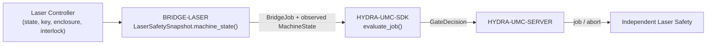

<!-- =============================================================================
HYDRA-UMC-BRIDGE-LASER - Laser-cell coordination bridge
Copyright (C) 2026 JuanenRac (Electro Hobby 3D) <electrohobby3d@gmail.com>
GPL-3.0-or-later - see LICENSE
============================================================================= -->

<p align="center">
  
</p>

# 🔦 HYDRA-UMC-BRIDGE-LASER

<p align="center">🇺🇸 <b>English</b> | <a href="README_spa.md">🇪🇸 Español</a> | <a href="README_fra.md">🇫🇷 Français</a> | <a href="README_ita.md">🇮🇹 Italiano</a> | <a href="README_deu.md">🇩🇪 Deutsch</a> | <a href="README_zho.md">🇨🇳 简体中文</a> | <a href="README_jpn.md">🇯🇵 日本語</a></p>

### 🛑 Fail-Safe Coordination Bridge for Laser Cells

<p align="left">
  
  
  
</p>

---

## 1. 🛠️ TECHNICAL OVERVIEW

**HYDRA-UMC-BRIDGE-LASER** is the high-level bridge for laser cells and HYDRA-UMC robot auxiliaries. It can coordinate safe peripheral tasks such as material hand-off, but it can **never** arm, fire or override a laser controller — those are observations it reads, not authorities it holds.

It belongs to the **External Automation Bridges** family: a set of sibling repositories (CNC, LASER, OPENPNP, PRINTER3D, ROS2) that all speak the same shared safety contract from `HYDRA-UMC-SDK`, so no bridge can invent its own definition of "safe to work".

### Key Features:
* ✅ **Real four-signal safety snapshot:** `cell.py`'s `LaserSafetySnapshot.machine_state()` requires the key switch enabled, the enclosure closed **and** the interlock healthy simultaneously — any one missing resolves to `SAFE_STOP`, before `controller_state` is even read. *(implemented, tested in `tests/test_cell.py`)*
* ✅ **Real shared safety gate:** every observed job is re-evaluated through `evaluate_job()` from `HYDRA-UMC-SDK`'s `bridge_contract`, the same gate every sibling bridge and HYDRA-UMC-SERVER use. *(implemented)*
* ✅ **Conservative state mapping:** only `IDLE` is treated as idle; `RUN`/`RUNNING` maps to `RUNNING`, `PAUSED` maps to `HOLDING` (a real, distinct condition - the beam is not actively cutting/engraving), `FAULT`/`ALARM`/`ERROR` map to `FAULT`, and anything unrecognized falls back to `OFFLINE`. *(implemented)*
* ✅ **Read-only safety evidence:** `observation.py` accepts only genuine Boolean key, enclosure and interlock signals; missing, numeric or text-like values fail closed. It cannot arm or fire a laser. *(implemented, tested in `tests/test_observation.py`)*
* ✅ **Real, controller-neutral GPIO interlock reading:** `gpio_safety.py`'s `GpioSafetyProbe` reads the same 3 independent safeguards from real GPIO lines (libgpiod v2) instead of a saved mapping - deliberately controller-agnostic, since a key switch/door sensor/interlock relay is universal across laser cutters regardless of brand. A GPIO read failure fails all 3 safeguards closed. *(implemented, tested in `tests/test_gpio_safety.py`)*
* ✅ **Non-mutating build/test:** `build-test.bat`/`.sh` compile the source and run the deterministic safety-gate test suite without touching version files or CHANGELOG. *(implemented, see BUILD & RUN below)*
* 🔜 **Concrete laser controller/software integration** — deliberately deferred until the machine and its documented interface are available; GPIO-level interlock reading is real today, a specific G-code/controller command path isn't. *(planned)*

---

## 2. 🔄 CELL COORDINATION FLOW



---

## 3. 🧱 ARCHITECTURE & DESIGN DECISIONS

* **Why four independent safety observations instead of one boolean.** `LaserSafetySnapshot.machine_state()` checks `key_enabled`, `enclosure_closed` and `interlock_healthy` as three separate conditions — real laser safety needs every physical safeguard to be independently true; collapsing them into one flag would hide which one actually failed.
* **Why the bridge documents that it can never arm or fire a laser.** `LaserCellBridge`'s own docstring states it "coordinates only external auxiliaries; it cannot arm or fire a laser" — those conditions are observations of the controller's own certified interlocks, never a substitute for them.
* **Why the controller-state mapping is deliberately conservative.** Only the literal string `IDLE` maps to `MachineState.IDLE`. Every unrecognized value falls back to `OFFLINE`, never to something that would permit auxiliary work.
* **Why the bridge builds a new `BridgeJob` and delegates to the shared `evaluate_job()` instead of writing its own accept/reject logic.** All five External Automation Bridges (CNC, LASER, OPENPNP, PRINTER3D, ROS2) reuse the exact same `bridge_contract` from `HYDRA-UMC-SDK`, so "what counts as safe to start a job" cannot silently diverge between them.
* **Why the choice of real laser software/controller is intentionally deferred.** Committing to a specific vendor interface before the machine and its documented interlock reporting are available would mean claiming a real safety guarantee this local core cannot verify.
* **How this fits the rest of the ecosystem.** BRIDGE-LASER sits between the laser controller and `HYDRA-UMC-SDK` → `HYDRA-UMC-SERVER` → independent safety — it coordinates auxiliary robot work around the laser cell, it does not replace or override certified laser safety.

The observation helper is an evidence normalizer, not a laser-controller adapter: it does not open a network or serial link, alter settings, upload jobs, arm or fire. [Laser Controller Evidence Boundary](docs/CONTROLLER_EVIDENCE_BOUNDARY.md) defines the validation required before a real integration.

---

## 📂 DIRECTORY STRUCTURE

```text
HYDRA-UMC-BRIDGE-LASER/
├── src/
│   └── hydra_umc_bridge_laser/
│       ├── __init__.py
│       ├── cell.py              # LaserSafetySnapshot + LaserCellBridge safety gate
│       ├── observation.py       # Read-only safety-evidence normalization
│       ├── gpio_safety.py       # Reads the 3 real independent safeguard signals over GPIO - never a laser command
│       └── mqtt_transport.py    # Real MQTT broker transport - status/evidence only, this bridge cannot arm or fire a laser
├── tests/
│   ├── test_cell.py             # Safe-idle admission, enclosure rejection, abort forwarding
│   ├── test_observation.py      # Missing safety evidence fails closed
│   ├── test_gpio_safety.py      # Real GPIO safeguard reads against a fake chip, incl. fail-closed paths
│   └── test_mqtt_transport.py   # MQTT status/evidence shape tests against a fake broker client
├── tools/
│   ├── build_test.py            # Non-mutating compile + test runner (build-test.bat/.sh)
│   └── bump_version.py          # Synchronizes pyproject.toml, manifest and CHANGELOG.md
├── docs/
│   ├── BRIDGE_GUIDE.md                    # Scope, compatible platforms, scripts, hardware acceptance gate
│   └── CONTROLLER_EVIDENCE_BOUNDARY.md    # What counts as real safety evidence vs. what this bridge refuses to infer
├── images/
│   └── HYDRA_UMC_BANNER.svg     # README banner
├── build-test.bat / build-test.sh  # Validate only, never modifies the repository
├── build.bat / build.sh            # Validate, then bump version + CHANGELOG on success
├── pyproject.toml               # Package metadata; depends on HYDRA-UMC-SDK (git)
├── hydra-umc.project.json       # Ecosystem manifest (version, maturity, family)
├── CHANGELOG.md
├── CODE_OF_CONDUCT.md / CONTRIBUTING.md / SECURITY.md / SUPPORT.md
├── LICENSE / LICENSE.md
└── README.md / README_*.md      # This file and its 6 translations
```

---

## 4. ⚙️ BUILD & RUN

Requires Python 3.11+. `tools/build_test.py` expects `HYDRA-UMC-SDK` checked out as a sibling directory (`../HYDRA-UMC-SDK`) or pointed at via the `HYDRA_UMC_SDK_ROOT` environment variable.

```bash
# Windows
build-test.bat      # validate only — no version/CHANGELOG change
build.bat            # validate, then bump version + CHANGELOG on success

# Linux/macOS
bash build-test.sh
bash build.sh
```

`build-test` compiles every module under `src/` with `py_compile` and runs the full `unittest` suite (`tests/test_cell.py`), proving safe-idle admission, enclosure rejection and abort forwarding — it never modifies the repository. `build` runs that same validation first and, only on success, calls `tools/bump_version.py` to synchronize the version across `pyproject.toml`, `hydra-umc.project.json` and `CHANGELOG.md`. There is no live laser `run` command yet — that requires a validated, safe controller integration.

---

## ✅ Current Status & Next Steps

**Real today:** version `0.0.7`, a locally tested fail-safe planning core (`LaserSafetySnapshot` + `LaserCellBridge`) backed by `HYDRA-UMC-SDK`'s shared job gate, strict read-only safety-evidence normalization distinguishing a real paused job (`HOLDING`) from an actively firing one (`RUNNING`), a real controller-neutral GPIO reader (`GpioSafetyProbe`) for the 3 independent key/enclosure/interlock safeguards, a twenty-seven-test deterministic `unittest` suite, and non-mutating build-test scripts wired into CI with an SDK checkout.

**Integration boundary:** the laser controller's own certified enclosure, key-switch and interlock authority is never bypassed; this bridge only ever gates *auxiliary* robot work around it, and only by reading its reported state.

**Still ahead:** the bridge has not been connected to or used to operate a real laser system — choosing and validating a concrete controller/software interface is deferred until the machine and its documented interface are available.

---

## 🔗 Related Projects

This project is part of the HYDRA-UMC robotics ecosystem by the same author (JuanenRac / Electro Hobby 3D). Worth knowing about, since a request might actually be about one of these rather than this repository.

**Parent Project**
- **[HYDRA-UMC-SERVER](https://github.com/JuanenRac/HYDRA-UMC-SERVER)** — the real headless backend (REST/WebSocket) every control client actually talks to; the authenticated ecosystem boundary this bridge reports to once each command has cleared this bridge's own local safety gate.

**Sibling Projects** — also talk to HYDRA-UMC-SERVER's own API, each their own client
- **[HYDRA-UMC-STUDIO](https://github.com/JuanenRac/HYDRA-UMC-STUDIO)** — web control dashboard with real-time multi-robot 3D visualization.
- **[HYDRA-UMC-SUITE](https://github.com/JuanenRac/HYDRA-UMC-SUITE)** — desktop (PySide6) swarm command center for multiple servers at once, packaged as a standalone executable.
- **[HYDRA-UMC-ANDROID-CONTROL](https://github.com/JuanenRac/HYDRA-UMC-ANDROID-CONTROL)** — native Android control app with biometric login and a paired Wear OS companion.
- **[HYDRA-UMC-IOS-CONTROL](https://github.com/JuanenRac/HYDRA-UMC-IOS-CONTROL)** — iOS/iPadOS control app (Flutter) with real-time WebSocket sync.
- **[HYDRA-UMC-DSI](https://github.com/JuanenRac/HYDRA-UMC-DSI)** — native touch UI for the onboard 7" DSI touchscreen, embedded on the CM5 itself.
- **[HYDRA-UMC-BRIDGE-AMR](https://github.com/JuanenRac/HYDRA-UMC-BRIDGE-AMR)** — coordination boundary for AGV/AMR fleets via a real VDA 5050 MQTT publisher.
- **[HYDRA-UMC-BRIDGE-CNC](https://github.com/JuanenRac/HYDRA-UMC-BRIDGE-CNC)** — high-level CNC-cell coordinator with real GRBL status/control-byte access.
- **[HYDRA-UMC-BRIDGE-DROIDS](https://github.com/JuanenRac/HYDRA-UMC-BRIDGE-DROIDS)** — coordination boundary for legged/humanoid droids, with a real Boston Dynamics Spot command sender.
- **[HYDRA-UMC-BRIDGE-OPENPNP](https://github.com/JuanenRac/HYDRA-UMC-BRIDGE-OPENPNP)** — safe high-level board-flow coordinator for OpenPnP pick-and-place.
- **[HYDRA-UMC-BRIDGE-PRINTER3D](https://github.com/JuanenRac/HYDRA-UMC-BRIDGE-PRINTER3D)** — safe coordination boundary for Moonraker/Klipper 3D printers, with real gated job commands.
- **[HYDRA-UMC-BRIDGE-ROS2](https://github.com/JuanenRac/HYDRA-UMC-BRIDGE-ROS2)** — safety coordinator with a real, lazily-imported rclpy ROS 2 transport.
- **[HYDRA-UMC-BRIDGE-UAV](https://github.com/JuanenRac/HYDRA-UMC-BRIDGE-UAV)** — coordination boundary for camera-equipped UAVs, with a real MAVLink command sender.

**Directly Related**
- **[HYDRA-UMC-SDK](https://github.com/JuanenRac/HYDRA-UMC-SDK)** — the shared JSON-Schema contract and safety-gate boundary every bridge validates its commands against.
- **[HYDRA-UMC-MQTT-BROKER](https://github.com/JuanenRac/HYDRA-UMC-MQTT-BROKER)** — `mqtt_transport.py`'s real transport for this bridge's own `hydra/bridges/laser/...` topics — safeguard status only, since no real actuation command exists here (this bridge can't arm or fire a laser either way); see that repo's own `docs/BRIDGE_TOPICS.md`.
- **[HYDRA-UMC-SAFETY-ZONES](https://github.com/JuanenRac/HYDRA-UMC-SAFETY-ZONES)** — future cell-zone safety evidence for this bridge.

**Also Part of the Ecosystem**

*Core Hardware & Platform*
- **[HYDRA-UMC](https://github.com/JuanenRac/HYDRA-UMC)** — the physical robot-arm motherboard: CM5 host + dual-core STM32H745, orchestrating up to 8 tool arms over CAN-OTA/SPI-OTA.
- **[HYDRA-UMC-OS](https://github.com/JuanenRac/HYDRA-UMC-OS)** — reproducible Raspberry Pi OS product layer for the CM5: read-only agent, validated config/profiles, WiFi first-contact provisioning.

*Core Backend & Clients*
- **[HYDRA-UMC-EDITOR-URDF](https://github.com/JuanenRac/HYDRA-UMC-EDITOR-URDF)** — desktop graphical URDF creator/editor that pushes finished models into STUDIO's own catalog.

*URTC Tool Platform*
- **[URTC](https://github.com/JuanenRac/URTC)** — firmware for the physical Universal Robot Tool Controller PCB, 25+ tool profiles over CAN bus.
- **[URTC-FLASHER](https://github.com/JuanenRac/URTC-FLASHER)** — desktop GUI flashing tool for URTC boards, CAN-OTA plus full-chip SWD/JTAG.
- **[URTC-TESTER](https://github.com/JuanenRac/URTC-TESTER)** — desktop live CAN-bus diagnostic tool for URTC boards, one panel per tool profile.
- **[URTC-WEB-STUDIO](https://github.com/JuanenRac/URTC-WEB-STUDIO)** — browser-based alternative to URTC-TESTER via the Web Serial API, no local install needed.

*Vision AI Node (Hailo-8)*
- **[HYDRA-UMC-VISION-NODE](https://github.com/JuanenRac/HYDRA-UMC-VISION-NODE)** — integration hub for the Hailo-8 vision pipeline, with a real per-stage hardware-readiness check.
- **[HYDRA-UMC-DETECTION-HEF](https://github.com/JuanenRac/HYDRA-UMC-DETECTION-HEF)** — real compiled-model registry with Hailo-architecture/checksum safe-load verification.
- **[HYDRA-UMC-VISION-STREAMER](https://github.com/JuanenRac/HYDRA-UMC-VISION-STREAMER)** — real GStreamer pipeline + MediaMTX config generator with a real HailoRT integration boundary.
- **[HYDRA-UMC-VISUAL-SERVOING-API](https://github.com/JuanenRac/HYDRA-UMC-VISUAL-SERVOING-API)** — real Position-Based Visual Servoing correction law, safety-gated on upstream zone state.

*Cognitive AI Node (Hailo-10)*
- **[HYDRA-UMC-COGNITIVE-NODE](https://github.com/JuanenRac/HYDRA-UMC-COGNITIVE-NODE)** — integration hub for the Hailo-10 cognitive pipeline (LLM/VLA/voice orchestration).
- **[HYDRA-UMC-VLA-ENGINE](https://github.com/JuanenRac/HYDRA-UMC-VLA-ENGINE)** — real action-token encoding/decoding and trajectory generation for a Vision-Language-Action model.
- **[HYDRA-UMC-VOICE-UI](https://github.com/JuanenRac/HYDRA-UMC-VOICE-UI)** — real voice front-end (VAD + intent parser) with a bounded, confirmation-gated Watch relay.
- **[HYDRA-UMC-SEMANTIC-PLANNER](https://github.com/JuanenRac/HYDRA-UMC-SEMANTIC-PLANNER)** — real rule-based task decomposition and semantic error recovery over MCU error codes.
- **[HYDRA-UMC-DOCS-QA](https://github.com/JuanenRac/HYDRA-UMC-DOCS-QA)** — real stdlib-only TF-IDF document search over this ecosystem's own Markdown docs.

*Orchestration & Swarm*
- **[HYDRA-UMC-ORCHESTRATOR](https://github.com/JuanenRac/HYDRA-UMC-ORCHESTRATOR)** — integration hub with a real gRPC/Protobuf health-report contract and mission state machine.
- **[HYDRA-UMC-JOB-DISPATCHER](https://github.com/JuanenRac/HYDRA-UMC-JOB-DISPATCHER)** — real priority-based job queue with deduplication, over a real HTTP API.
- **[HYDRA-UMC-NODE-HEALING](https://github.com/JuanenRac/HYDRA-UMC-NODE-HEALING)** — real gRPC-based fleet health watchdog with retry/backoff and identity-mismatch detection.
- **[HYDRA-UMC-PATH-PLANNER-3D](https://github.com/JuanenRac/HYDRA-UMC-PATH-PLANNER-3D)** — real RRT-based 3D path planner with real obstacle/workspace collision validation.
- **[HYDRA-UMC-SWARM-SYNC](https://github.com/JuanenRac/HYDRA-UMC-SWARM-SYNC)** — real CRDT LWW-Element-Map state sync, property-tested for multi-cell convergence.

*Digital Twin & Simulation*
- **[HYDRA-UMC-TWIN](https://github.com/JuanenRac/HYDRA-UMC-TWIN)** — integration hub for the digital-twin engine, with a real version-compatibility sync contract.
- **[HYDRA-UMC-HIL-BRIDGE](https://github.com/JuanenRac/HYDRA-UMC-HIL-BRIDGE)** — real hardware-in-the-loop safety interlock routing commands between simulation and real hardware.
- **[HYDRA-UMC-PHYSICS-REPLICA](https://github.com/JuanenRac/HYDRA-UMC-PHYSICS-REPLICA)** — real forward kinematics and joint-limit validation over a real URDF subset.
- **[HYDRA-UMC-SYNTHETIC-DATA-GEN](https://github.com/JuanenRac/HYDRA-UMC-SYNTHETIC-DATA-GEN)** — real procedural 2D scene generator with YOLO/COCO annotation export.

*Data & Analytics*
- **[HYDRA-UMC-DATALAKE](https://github.com/JuanenRac/HYDRA-UMC-DATALAKE)** — real sqlite3-backed time-series store with a real ingest/query HTTP API.
- **[HYDRA-UMC-ANOMALY-DETECTOR](https://github.com/JuanenRac/HYDRA-UMC-ANOMALY-DETECTOR)** — real FFT + statistical baseline anomaly detector with drift monitoring.
- **[HYDRA-UMC-PRODUCTION-REPORTS](https://github.com/JuanenRac/HYDRA-UMC-PRODUCTION-REPORTS)** — real OEE/availability calculation over DATALAKE history, with reproducible CSV export.
- **[HYDRA-UMC-TELEMETRY-COLLECTOR](https://github.com/JuanenRac/HYDRA-UMC-TELEMETRY-COLLECTOR)** — real CAN/WebSocket ingestion pipeline into DATALAKE, with sequence deduplication.

*Industrial Gateway*
- **[HYDRA-UMC-GATEWAY-INDUSTRIAL](https://github.com/JuanenRac/HYDRA-UMC-GATEWAY-INDUSTRIAL)** — integration hub relaying to industrial protocols, with a real command allowlist/backpressure layer.
- **[HYDRA-UMC-OPCUA-SERVER](https://github.com/JuanenRac/HYDRA-UMC-OPCUA-SERVER)** — real OPC-UA address space, verified with a real binary-protocol client session.
- **[HYDRA-UMC-MTCONNECT-ADAPTER](https://github.com/JuanenRac/HYDRA-UMC-MTCONNECT-ADAPTER)** — real MTConnect `/probe` and `/current` XML endpoints with degraded-mode output.

*Complementary Tools & Ecosystem Operations*
- **[HYDRA-UMC-DASHBOARD-AI](https://github.com/JuanenRac/HYDRA-UMC-DASHBOARD-AI)** — Smart Summaries and Anomaly Highlighting panels over DATALAKE/ANOMALY-DETECTOR, with an honest statistical fallback.
- **[HYDRA-UMC-TOOL-CLI](https://github.com/JuanenRac/HYDRA-UMC-TOOL-CLI)** — fleet CLI with a real, stable exit-code contract, a genuine live client of HYDRA-UMC-SERVER's own API.
- **[HYDRA-UMC-WATCH](https://github.com/JuanenRac/HYDRA-UMC-WATCH)** — WearOS companion app with real haptic alerts and a paired-phone voice relay.
- **[URTC-SMART-RACK](https://github.com/JuanenRac/URTC-SMART-RACK)** — firmware for a board-mounting rack with real tool-ID decoding and Smart Idle pre-heating logic.
- **[URTC-VISION-TOOL](https://github.com/JuanenRac/URTC-VISION-TOOL)** — firmware plus a real Python vision companion for a thermal/RGB inspection tool head.
- **[HYDRA-UMC-UPDATER](https://github.com/JuanenRac/HYDRA-UMC-UPDATER)** — administrative desktop tool that discovers, clones and updates every repo in this ecosystem.

---

## 📚 Documentation & Community

- **[CONTRIBUTING.md](CONTRIBUTING.md)** — tech stack and coding guidelines for a pull request.
- **[CODE_OF_CONDUCT.md](CODE_OF_CONDUCT.md)** — the standards of behavior expected in this community.
- **[SECURITY.md](SECURITY.md)** — how to report a vulnerability, and this project's own real security focus areas.
- **[SUPPORT.md](SUPPORT.md)** — where to ask questions and report bugs.
- **[LICENSE.md](LICENSE.md)** — this project's own license.

## 👤 AUTHOR
**JuanenRac** (Electro Hobby 3D)
📧 electrohobby3d@gmail.com
📺 [youtube.com/@electrohobby3d](https://youtube.com/@electrohobby3d)

## 📜 LICENSE
GPL-3.0 - See LICENSE for details.
