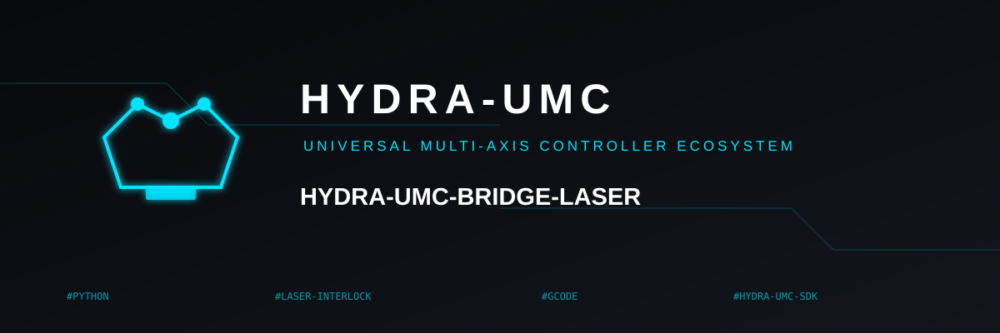
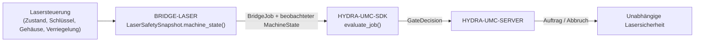

<!-- =============================================================================
HYDRA-UMC-BRIDGE-LASER - Laserzellen-Koordinationsbrücke
Copyright (C) 2026 JuanenRac (Electro Hobby 3D) <electrohobby3d@gmail.com>
GPL-3.0-or-later - see LICENSE
============================================================================= -->

<p align="center">
  
</p>

# 🔦 HYDRA-UMC-BRIDGE-LASER

<p align="center"><a href="README.md">🇺🇸 English</a> | <a href="README_spa.md">🇪🇸 Español</a> | <a href="README_fra.md">🇫🇷 Français</a> | <a href="README_ita.md">🇮🇹 Italiano</a> | 🇩🇪 <b>Deutsch</b> | <a href="README_zho.md">🇨🇳 简体中文</a> | <a href="README_jpn.md">🇯🇵 日本語</a></p>

### 🛑 Ausfallsichere Koordinationsbrücke für Laserzellen

<p align="left">
  
  
  
</p>

---

## 1. 🛠️ TECHNISCHER ÜBERBLICK

**HYDRA-UMC-BRIDGE-LASER** ist die High-Level-Brücke für Laserzellen und HYDRA-UMC-Roboterhilfsfunktionen. Sie kann sichere Randaufgaben wie die Materialübergabe koordinieren, kann eine Lasersteuerung jedoch **niemals** scharfschalten, auslösen oder überstimmen — das sind Beobneunungen, die sie liest, keine Befugnisse, die sie besitzt.

Sie gehört zur Familie **External Automation Bridges**: einer Gruppe von Schwester-Repositories (CNC, LASER, OPENPNP, PRINTER3D, ROS2), die alle denselben gemeinsamen Sicherheitsvertrag von `HYDRA-UMC-SDK` sprechen, sodass keine Brücke ihre eigene Definition von "sicher zum Arbeiten" erfinden kann.

### Kernfunktionen:
* ✅ **Echter Vier-Signal-Sicherheits-Snapshot:** `cell.py` — `LaserSafetySnapshot.machine_state()` verlangt, dass der Schlüsselschalter aktiviert, das Gehäuse geschlossen **und** die Verriegelung intakt sind — gleichzeitig; fehlt eines davon, wird auf `SAFE_STOP` aufgelöst, noch bevor `controller_state` überhaupt gelesen wird. *(implementiert, getestet in `tests/test_cell.py`)*
* ✅ **Echtes gemeinsames Sicherheitsgatter:** jeder beobachtete Auftrag wird über `evaluate_job()` aus dem `bridge_contract` von `HYDRA-UMC-SDK` neu bewertet — demselben Gatter, das jede Schwesterbrücke und HYDRA-UMC-SERVER verwenden. *(implementiert)*
* ✅ **Konservative Zustandsabbildung:** nur `IDLE` wird als Leerlauf behandelt; `RUN`/`RUNNING`/`PAUSED` werden auf `RUNNING` abgebildet, `FAULT`/`ALARM`/`ERROR` auf `FAULT`, und jeder nicht erkannte Wert fällt auf `OFFLINE` zurück. *(implementiert)*
* ✅ **Schreibgeschützter Sicherheitsnachweis:** `observation.py` akzeptiert nur echte boolesche Signale für Schlüssel, Gehäuse und Verriegelung; fehlende, numerische oder textartige Werte schlagen sicher fehl. Es kann einen Laser weder scharfschalten noch auslösen. *(implementiert, getestet in `tests/test_observation.py`)*
* ✅ **Echtes, controller-neutrales GPIO-Verriegelungs-Lesen:** `GpioSafetyProbe` aus `gpio_safety.py` liest dieselben 3 unabhängigen Schutzeinrichtungen von echten GPIO-Leitungen (libgpiod v2) statt aus einem gespeicherten Mapping - bewusst controller-unabhängig, da ein Schlüsselschalter/Türsensor/Verriegelungsrelais bei Laserschneidern herstellerunabhängig universell ist. Ein GPIO-Lesefehler lässt alle 3 Schutzeinrichtungen sicher fehlschlagen. *(implementiert, getestet in `tests/test_gpio_safety.py`)*
* ✅ **Nicht-mutierender Build/Test:** `build-test.bat`/`.sh` kompilieren den Quellcode und führen die Sicherheitsgatter-Testsuite aus, ohne Versionsdateien oder das CHANGELOG anzufassen. *(implementiert, siehe BUILD & AUSFÜHRUNG unten)*
* 🔜 **Konkrete Laser-Controller-/Software-Integration** — bewusst zurückgestellt, bis Maschine und dokumentierte Schnittstelle verfügbar sind. *(geplant)*

---

## 2. 🔄 ZELLKOORDINATIONSABLAUF



---

## 3. 🧱 ARCHITEKTUR UND DESIGN-ENTSCHEIDUNGEN

* **Warum vier unabhängige Sicherheitsbeobneunungen statt eines einzelnen Booleans.** `LaserSafetySnapshot.machine_state()` prüft `key_enabled`, `enclosure_closed` und `interlock_healthy` als drei getrennte Bedingungen — echte Lasersicherheit erfordert, dass jede physische Schutzmaßnahme unabhängig voneinander wahr ist; sie zu einem einzigen Flag zusammenzufassen würde verschleiern, welche davon tatsächlich fehlgeschlagen ist.
* **Warum die Brücke dokumentiert, dass sie einen Laser niemals scharfschalten oder auslösen kann.** Der eigene Docstring von `LaserCellBridge` besagt, dass sie "nur externe Hilfsfunktionen koordiniert; sie kann einen Laser nicht scharfschalten oder auslösen" — diese Bedingungen sind Beobneunungen der eigenen zertifizierten Verriegelungen der Steuerung, niemals ein Ersatz dafür.
* **Warum die Zustandsabbildung des Controllers bewusst konservativ ist.** Nur die wörtliche Zeichenkette `IDLE` wird auf `MachineState.IDLE` abgebildet. Jeder nicht erkannte Wert fällt auf `OFFLINE` zurück, niemals auf etwas, das Hilfsarbeit erlauben würde.
* **Warum die Brücke einen neuen `BridgeJob` erstellt und an das gemeinsame `evaluate_job()` delegiert, statt eigene Annahme-/Ablehnungslogik zu schreiben.** Alle fünf External Automation Bridges (CNC, LASER, OPENPNP, PRINTER3D, ROS2) verwenden exakt denselben `bridge_contract` von `HYDRA-UMC-SDK` wieder, sodass "was als sicher für den Start eines Auftrags zählt" zwischen ihnen nicht stillschweigend auseinanderdriften kann.
* **Warum die Wahl der echten Laser-Software/-Steuerung bewusst zurückgestellt wird.** Sich auf die Schnittstelle eines bestimmten Herstellers festzulegen, bevor Maschine und ihre dokumentierte Verriegelungsmeldung verfügbar sind, würde bedeuten, eine echte Sicherheitsgarantie zu behaupten, die dieser lokale Kern nicht verifizieren kann.
* **Wie das in den Rest des Ökosystems passt.** BRIDGE-LASER sitzt zwischen der Lasersteuerung und `HYDRA-UMC-SDK` → `HYDRA-UMC-SERVER` → unabhängiger Sicherheit: es koordiniert Roboter-Hilfsarbeit rund um die Laserzelle, es ersetzt oder überschreibt nicht die zertifizierte Lasersicherheit.

---

## 📂 VERZEICHNISSTRUKTUR

```text
HYDRA-UMC-BRIDGE-LASER/
├── src/
│   └── hydra_umc_bridge_laser/
│       ├── __init__.py
│       ├── cell.py              # Sicherheitsgatter LaserSafetySnapshot + LaserCellBridge
│       ├── observation.py       # Nur-Lese-Normalisierung der Sicherheitsnachweise
│       ├── gpio_safety.py       # Liest die 3 echten unabhängigen Schutzsignale über GPIO - niemals ein Laserbefehl
│       └── mqtt_transport.py    # Echter MQTT-Broker-Transport - nur Status/Nachweis, diese Bridge kann keinen Laser scharfschalten oder auslösen
├── tests/
│   ├── test_cell.py             # Zulassung im sicheren Leerlauf, Gehäuse-Ablehnung, Abbruchweiterleitung
│   ├── test_observation.py      # Fehlende Sicherheitsnachweise schlagen fail-closed fehl
│   ├── test_gpio_safety.py      # Echte GPIO-Sicherheitslesungen gegen einen simulierten Chip, inkl. Fail-Closed-Pfade
│   └── test_mqtt_transport.py   # MQTT-Status-/Nachweisform-Tests gegen einen simulierten Broker-Client
├── tools/
│   ├── build_test.py            # Nicht-mutierender Compiler + Testläufer (build-test.bat/.sh)
│   └── bump_version.py          # Synchronisiert pyproject.toml, Manifest und CHANGELOG.md
├── docs/
│   ├── BRIDGE_GUIDE.md                    # Umfang, kompatible Plattformen, Skripte, Hardware-Abnahmegatter
│   └── CONTROLLER_EVIDENCE_BOUNDARY.md    # Was als echter Sicherheitsnachweis zählt und was diese Bridge nicht ableitet
├── images/
│   └── HYDRA_UMC_BANNER.svg     # README-Banner
├── build-test.bat / build-test.sh  # Validiert nur, ändert das Repository nie
├── build.bat / build.sh            # Validiert und erhöht bei Erfolg Version + CHANGELOG
├── pyproject.toml               # Paket-Metadaten; hängt von HYDRA-UMC-SDK ab (git)
├── hydra-umc.project.json       # Ökosystem-Manifest (Version, Reifegrad, Familie)
├── CHANGELOG.md
├── CODE_OF_CONDUCT.md / CONTRIBUTING.md / SECURITY.md / SUPPORT.md
├── LICENSE / LICENSE.md
└── README.md / README_*.md      # Diese Datei und ihre 6 Übersetzungen
```

---

## 4. ⚙️ BUILD & AUSFÜHRUNG

Erfordert Python 3.11+. `tools/build_test.py` erwartet, dass `HYDRA-UMC-SDK` als Schwesterverzeichnis (`../HYDRA-UMC-SDK`) ausgecheckt oder über die Umgebungsvariable `HYDRA_UMC_SDK_ROOT` angegeben ist.

```bash
# Windows
build-test.bat      # nur Validierung — keine Versions-/CHANGELOG-Änderung
build.bat            # validiert und erhöht bei Erfolg Version + CHANGELOG

# Linux/macOS
bash build-test.sh
bash build.sh
```

`build-test` kompiliert jedes Modul unter `src/` mit `py_compile` und führt die vollständige `unittest`-Suite aus (`tests/test_cell.py`), was die Zulassung im sicheren Leerlauf, die Gehäuse-Ablehnung und die Abbruchweiterleitung belegt — es ändert das Repository nie. `build` führt zuerst dieselbe Validierung aus und ruft nur bei Erfolg `tools/bump_version.py` auf, um die Version in `pyproject.toml`, `hydra-umc.project.json` und `CHANGELOG.md` zu synchronisieren. Es gibt noch keinen echten Laser-`run`-Befehl — dafür ist eine validierte, sichere Controller-Integration erforderlich.

---

## ✅ AKTUELLER STATUS UND NÄCHSTE SCHRITTE

**Heute real:** Version `0.0.7`, ein lokal getesteter ausfallsicherer Planungskern (`LaserSafetySnapshot` + `LaserCellBridge`), gestützt auf das gemeinsame Auftragsgatter von `HYDRA-UMC-SDK`, strenge schreibgeschützte Normalisierung von Sicherheits-Evidenz, die einen echt pausierten Auftrag (`HOLDING`) von einem echt aktiv feuernden (`RUNNING`) unterscheidet, ein echtes, controller-neutrales GPIO-Verriegelungs-Lesen (`GpioSafetyProbe`) für die 3 unabhängigen Schlüssel-/Gehäuse-/Verriegelungs-Schutzeinrichtungen, eine deterministische `unittest`-Suite mit siebenundzwanzig Tests sowie nicht-mutierende Build-Test-Skripte, die in CI mit SDK-Checkout eingebunden sind.

**Integrationsgrenze:** das eigene zertifizierte Gehäuse, der Schlüsselschalter und die Verriegelungsautorität der Lasersteuerung werden nie umgangen; diese Brücke steuert ausschließlich *Hilfs*-Roboterarbeit um sie herum, und das nur durch Lesen ihres gemeldeten Zustands.

**Noch offen:** die Brücke wurde noch nicht mit einem realen Lasersystem verbunden oder zu dessen Betrieb genutzt — die Auswahl und Validierung einer konkreten Controller-/Software-Schnittstelle wird zurückgestellt, bis Maschine und ihre dokumentierte Schnittstelle verfügbar sind.

---

## 🔗 Verwandte Projekte

Dieses Projekt ist Teil des HYDRA-UMC-Robotik-Ökosystems desselben Autors (JuanenRac / Electro Hobby 3D). Gut zu wissen, da eine Anfrage eigentlich eines dieser Projekte betreffen könnte statt dieses Repositorys.

**Übergeordnetes Projekt**
- **[HYDRA-UMC-SERVER](https://github.com/JuanenRac/HYDRA-UMC-SERVER)** — das reale Headless-Backend (REST/WebSocket), mit dem jeder Steuerungsclient tatsächlich spricht; die authentifizierte Ökosystemgrenze, an die diese Bridge berichtet, sobald jeder Befehl die eigene lokale Sicherheitsschranke dieser Bridge durchlaufen hat.

**Geschwisterprojekte** — sprechen ebenfalls mit der eigenen API von HYDRA-UMC-SERVER, jeweils als eigener Client
- **[HYDRA-UMC-STUDIO](https://github.com/JuanenRac/HYDRA-UMC-STUDIO)** — Web-Steuerungs-Dashboard mit Echtzeit-3D-Visualisierung mehrerer Roboter.
- **[HYDRA-UMC-SUITE](https://github.com/JuanenRac/HYDRA-UMC-SUITE)** — Desktop-Schwarmleitstand (PySide6) für mehrere Server gleichzeitig, verpackt als eigenständige ausführbare Datei.
- **[HYDRA-UMC-ANDROID-CONTROL](https://github.com/JuanenRac/HYDRA-UMC-ANDROID-CONTROL)** — native Android-Steuerungs-App mit biometrischem Login und einer gekoppelten Wear-OS-Begleit-App.
- **[HYDRA-UMC-IOS-CONTROL](https://github.com/JuanenRac/HYDRA-UMC-IOS-CONTROL)** — iOS/iPadOS-Steuerungs-App (Flutter) mit Echtzeit-WebSocket-Synchronisierung.
- **[HYDRA-UMC-DSI](https://github.com/JuanenRac/HYDRA-UMC-DSI)** — native Touch-UI für das eingebaute 7"-DSI-Touchscreen, direkt auf dem CM5 eingebettet.
- **[HYDRA-UMC-BRIDGE-AMR](https://github.com/JuanenRac/HYDRA-UMC-BRIDGE-AMR)** — Koordinationsschranke für AGV-/AMR-Flotten über einen echten VDA-5050-MQTT-Publisher.
- **[HYDRA-UMC-BRIDGE-CNC](https://github.com/JuanenRac/HYDRA-UMC-BRIDGE-CNC)** — High-Level-Koordinator für CNC-Zellen mit echtem GRBL-Status-/Steuerbyte-Zugriff.
- **[HYDRA-UMC-BRIDGE-DROIDS](https://github.com/JuanenRac/HYDRA-UMC-BRIDGE-DROIDS)** — Koordinationsschranke für laufende/humanoide Droiden, mit einem echten Boston-Dynamics-Spot-Befehlssender.
- **[HYDRA-UMC-BRIDGE-OPENPNP](https://github.com/JuanenRac/HYDRA-UMC-BRIDGE-OPENPNP)** — sicherer High-Level-Koordinator für den Leiterplattenfluss von OpenPnP Pick-and-Place.
- **[HYDRA-UMC-BRIDGE-PRINTER3D](https://github.com/JuanenRac/HYDRA-UMC-BRIDGE-PRINTER3D)** — sichere Koordinationsschranke für Moonraker/Klipper-3D-Drucker, mit echten gesicherten Job-Befehlen.
- **[HYDRA-UMC-BRIDGE-ROS2](https://github.com/JuanenRac/HYDRA-UMC-BRIDGE-ROS2)** — Sicherheitskoordinator mit einem echten, träge importierten rclpy-ROS-2-Transport.
- **[HYDRA-UMC-BRIDGE-UAV](https://github.com/JuanenRac/HYDRA-UMC-BRIDGE-UAV)** — Koordinationsschranke für kameraausgestattete UAVs, mit einem echten MAVLink-Befehlssender.

**Direkt verwandt**
- **[HYDRA-UMC-SDK](https://github.com/JuanenRac/HYDRA-UMC-SDK)** — der gemeinsame JSON-Schema-Vertrag und die Sicherheitsschranke, gegen die jede Bridge ihre Befehle validiert.
- **[HYDRA-UMC-MQTT-BROKER](https://github.com/JuanenRac/HYDRA-UMC-MQTT-BROKER)** — der echte Transport von `mqtt_transport.py` für die eigenen `hydra/bridges/laser/...`-Topics dieser Bridge — nur Sicherungsstatus, da hier kein echter Aktivierungsbefehl existiert (diese Bridge kann einen Laser weder scharfschalten noch auslösen); siehe die eigene `docs/BRIDGE_TOPICS.md` dieses Repositorys.
- **[HYDRA-UMC-SAFETY-ZONES](https://github.com/JuanenRac/HYDRA-UMC-SAFETY-ZONES)** — zukünftiger Zellzonen-Sicherheitsnachweis für diese Bridge.

**Ebenfalls Teil des Ökosystems**

*Kern-Hardware & Plattform*
- **[HYDRA-UMC](https://github.com/JuanenRac/HYDRA-UMC)** — das physische Motherboard des Roboterarms: CM5-Host + Dual-Core-STM32H745, koordiniert bis zu 8 Werkzeugarme über CAN-OTA/SPI-OTA.
- **[HYDRA-UMC-OS](https://github.com/JuanenRac/HYDRA-UMC-OS)** — reproduzierbare Raspberry-Pi-OS-Produktschicht für den CM5: schreibgeschützter Agent, validierte Konfiguration/Profile, WiFi-Ersteinrichtung.

*Kern-Backend & Clients*
- **[HYDRA-UMC-EDITOR-URDF](https://github.com/JuanenRac/HYDRA-UMC-EDITOR-URDF)** — grafischer Desktop-URDF-Ersteller/-Editor, der fertige Modelle in STUDIOs eigenen Katalog überträgt.

*URTC-Werkzeugplattform*
- **[URTC](https://github.com/JuanenRac/URTC)** — Firmware für die physische Universal-Robot-Tool-Controller-Platine, 25+ Werkzeugprofile über CAN-Bus.
- **[URTC-FLASHER](https://github.com/JuanenRac/URTC-FLASHER)** — Desktop-GUI-Flash-Tool für URTC-Platinen, CAN-OTA plus Full-Chip-SWD/JTAG.
- **[URTC-TESTER](https://github.com/JuanenRac/URTC-TESTER)** — Desktop-Live-CAN-Bus-Diagnosetool für URTC-Platinen, ein Panel pro Werkzeugprofil.
- **[URTC-WEB-STUDIO](https://github.com/JuanenRac/URTC-WEB-STUDIO)** — browserbasierte Alternative zu URTC-TESTER über die Web-Serial-API, ohne lokale Installation.

*Vision-KI-Knoten (Hailo-8)*
- **[HYDRA-UMC-VISION-NODE](https://github.com/JuanenRac/HYDRA-UMC-VISION-NODE)** — Integrationsknoten für die Hailo-8-Vision-Pipeline, mit einer echten stufenweisen Hardware-Bereitschaftsprüfung.
- **[HYDRA-UMC-DETECTION-HEF](https://github.com/JuanenRac/HYDRA-UMC-DETECTION-HEF)** — echte Registry für kompilierte Modelle mit Hailo-Architektur-/Prüfsummen-Safe-Load-Verifizierung.
- **[HYDRA-UMC-VISION-STREAMER](https://github.com/JuanenRac/HYDRA-UMC-VISION-STREAMER)** — echter GStreamer-Pipeline- + MediaMTX-Konfigurationsgenerator mit einer echten HailoRT-Integrationsschranke.
- **[HYDRA-UMC-VISUAL-SERVOING-API](https://github.com/JuanenRac/HYDRA-UMC-VISUAL-SERVOING-API)** — echtes Position-Based-Visual-Servoing-Korrekturgesetz, sicherheitsgesteuert nach vorgelagertem Zonenstatus.

*Kognitiver KI-Knoten (Hailo-10)*
- **[HYDRA-UMC-COGNITIVE-NODE](https://github.com/JuanenRac/HYDRA-UMC-COGNITIVE-NODE)** — Integrationsknoten für die Hailo-10-Cognitive-Pipeline (LLM-/VLA-/Sprach-Orchestrierung).
- **[HYDRA-UMC-VLA-ENGINE](https://github.com/JuanenRac/HYDRA-UMC-VLA-ENGINE)** — echte Aktions-Token-Kodierung/-Dekodierung und Trajektoriengenerierung für ein Vision-Language-Action-Modell.
- **[HYDRA-UMC-VOICE-UI](https://github.com/JuanenRac/HYDRA-UMC-VOICE-UI)** — echtes Sprach-Frontend (VAD + Intent-Parser) mit einem begrenzten, bestätigungsgesicherten Watch-Relay.
- **[HYDRA-UMC-SEMANTIC-PLANNER](https://github.com/JuanenRac/HYDRA-UMC-SEMANTIC-PLANNER)** — echte regelbasierte Aufgabenzerlegung und semantische Fehlerbehebung über MCU-Fehlercodes.
- **[HYDRA-UMC-DOCS-QA](https://github.com/JuanenRac/HYDRA-UMC-DOCS-QA)** — echte, nur auf der Standardbibliothek basierende TF-IDF-Dokumentensuche über die eigenen Markdown-Dokumente dieses Ökosystems.

*Orchestrierung & Schwarm*
- **[HYDRA-UMC-ORCHESTRATOR](https://github.com/JuanenRac/HYDRA-UMC-ORCHESTRATOR)** — Integrationsknoten mit einem echten gRPC/Protobuf-Health-Report-Vertrag und einer Missions-Zustandsmaschine.
- **[HYDRA-UMC-JOB-DISPATCHER](https://github.com/JuanenRac/HYDRA-UMC-JOB-DISPATCHER)** — echte prioritätsbasierte Job-Queue mit Deduplizierung, über eine echte HTTP-API.
- **[HYDRA-UMC-NODE-HEALING](https://github.com/JuanenRac/HYDRA-UMC-NODE-HEALING)** — echter gRPC-basierter Flotten-Health-Watchdog mit Retry/Backoff und Identitäts-Mismatch-Erkennung.
- **[HYDRA-UMC-PATH-PLANNER-3D](https://github.com/JuanenRac/HYDRA-UMC-PATH-PLANNER-3D)** — echter RRT-basierter 3D-Pfadplaner mit echter Hindernis-/Arbeitsraum-Kollisionsvalidierung.
- **[HYDRA-UMC-SWARM-SYNC](https://github.com/JuanenRac/HYDRA-UMC-SWARM-SYNC)** — echte CRDT-LWW-Element-Map-Zustandssynchronisation, eigenschaftsgetestet auf Multi-Zellen-Konvergenz.

*Digitaler Zwilling & Simulation*
- **[HYDRA-UMC-TWIN](https://github.com/JuanenRac/HYDRA-UMC-TWIN)** — Integrationsknoten für die Digital-Twin-Engine, mit einem echten Versionskompatibilitäts-Sync-Vertrag.
- **[HYDRA-UMC-HIL-BRIDGE](https://github.com/JuanenRac/HYDRA-UMC-HIL-BRIDGE)** — echte Hardware-in-the-Loop-Sicherheitsverriegelung, die Befehle zwischen Simulation und echter Hardware routet.
- **[HYDRA-UMC-PHYSICS-REPLICA](https://github.com/JuanenRac/HYDRA-UMC-PHYSICS-REPLICA)** — echte Vorwärtskinematik und Gelenkgrenzenvalidierung über eine echte URDF-Teilmenge.
- **[HYDRA-UMC-SYNTHETIC-DATA-GEN](https://github.com/JuanenRac/HYDRA-UMC-SYNTHETIC-DATA-GEN)** — echter prozeduraler 2D-Szenengenerator mit YOLO/COCO-Annotationsexport.

*Daten & Analytik*
- **[HYDRA-UMC-DATALAKE](https://github.com/JuanenRac/HYDRA-UMC-DATALAKE)** — echter sqlite3-gestützter Zeitreihenspeicher mit einer echten Ingest-/Abfrage-HTTP-API.
- **[HYDRA-UMC-ANOMALY-DETECTOR](https://github.com/JuanenRac/HYDRA-UMC-ANOMALY-DETECTOR)** — echter FFT- + statistischer Basislinien-Anomaliedetektor mit Drift-Überwachung.
- **[HYDRA-UMC-PRODUCTION-REPORTS](https://github.com/JuanenRac/HYDRA-UMC-PRODUCTION-REPORTS)** — echte OEE-/Verfügbarkeitsberechnung über den DATALAKE-Verlauf, mit reproduzierbarem CSV-Export.
- **[HYDRA-UMC-TELEMETRY-COLLECTOR](https://github.com/JuanenRac/HYDRA-UMC-TELEMETRY-COLLECTOR)** — echte CAN/WebSocket-Ingestion-Pipeline in DATALAKE, mit Sequenz-Deduplizierung.

*Industrie-Gateway*
- **[HYDRA-UMC-GATEWAY-INDUSTRIAL](https://github.com/JuanenRac/HYDRA-UMC-GATEWAY-INDUSTRIAL)** — Integrationsknoten, der zu Industrieprotokollen weiterleitet, mit einer echten Befehls-Allowlist-/Backpressure-Schicht.
- **[HYDRA-UMC-OPCUA-SERVER](https://github.com/JuanenRac/HYDRA-UMC-OPCUA-SERVER)** — echter OPC-UA-Adressraum, verifiziert mit einer echten Binärprotokoll-Client-Session.
- **[HYDRA-UMC-MTCONNECT-ADAPTER](https://github.com/JuanenRac/HYDRA-UMC-MTCONNECT-ADAPTER)** — echte MTConnect-`/probe`- und `/current`-XML-Endpunkte mit Degraded-Mode-Ausgabe.

*Ergänzende Tools & Ökosystembetrieb*
- **[HYDRA-UMC-DASHBOARD-AI](https://github.com/JuanenRac/HYDRA-UMC-DASHBOARD-AI)** — Smart-Summaries- und Anomaly-Highlighting-Panels über DATALAKE/ANOMALY-DETECTOR, mit einem ehrlichen statistischen Fallback.
- **[HYDRA-UMC-TOOL-CLI](https://github.com/JuanenRac/HYDRA-UMC-TOOL-CLI)** — Flotten-CLI mit einem echten, stabilen Exit-Code-Vertrag, ein echter Live-Client der eigenen API von HYDRA-UMC-SERVER.
- **[HYDRA-UMC-WATCH](https://github.com/JuanenRac/HYDRA-UMC-WATCH)** — WearOS-Begleit-App mit echten haptischen Alarmen und einem Sprach-Relay zum gekoppelten Telefon.
- **[URTC-SMART-RACK](https://github.com/JuanenRac/URTC-SMART-RACK)** — Firmware für ein Platinenmontagegestell mit echter Werkzeug-ID-Dekodierung und Smart-Idle-Vorheizlogik.
- **[URTC-VISION-TOOL](https://github.com/JuanenRac/URTC-VISION-TOOL)** — Firmware plus ein echter Python-Vision-Begleiter für einen Thermal-/RGB-Inspektionswerkzeugkopf.
- **[HYDRA-UMC-UPDATER](https://github.com/JuanenRac/HYDRA-UMC-UPDATER)** — administratives Desktop-Tool, das jedes Repository in diesem Ökosystem entdeckt, klont und aktualisiert.

## 👤 AUTOR
**JuanenRac** (Electro Hobby 3D)
📧 electrohobby3d@gmail.com
📺 [youtube.com/@electrohobby3d](https://youtube.com/@electrohobby3d)

## 📜 LIZENZ
GPL-3.0 - Siehe LICENSE für Details.
