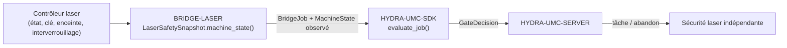

<!-- =============================================================================
HYDRA-UMC-BRIDGE-LASER - Pont de coordination de cellule laser
Copyright (C) 2026 JuanenRac (Electro Hobby 3D) <electrohobby3d@gmail.com>
GPL-3.0-or-later - see LICENSE
============================================================================= -->

<p align="center">
  
</p>

# 🔦 HYDRA-UMC-BRIDGE-LASER

<p align="center"><a href="README.md">🇺🇸 English</a> | <a href="README_spa.md">🇪🇸 Español</a> | 🇫🇷 <b>Français</b> | <a href="README_ita.md">🇮🇹 Italiano</a> | <a href="README_deu.md">🇩🇪 Deutsch</a> | <a href="README_zho.md">🇨🇳 简体中文</a> | <a href="README_jpn.md">🇯🇵 日本語</a></p>

### 🛑 Pont de coordination à sécurité intrinsèque pour cellules laser

<p align="left">
  
  
  
</p>

---

## 1. 🛠️ APERÇU TECHNIQUE

**HYDRA-UMC-BRIDGE-LASER** est le pont haut niveau pour les cellules laser et les auxiliaires robotiques HYDRA-UMC. Il peut coordonner des tâches périphériques sûres comme le transfert de matière, mais il ne peut **jamais** armer, déclencher ou outrepasser un contrôleur laser — ce sont des observations qu'il lit, pas des autorités qu'il détient.

Il appartient à la famille **External Automation Bridges** : un ensemble de dépôts frères (CNC, LASER, OPENPNP, PRINTER3D, ROS2) qui partagent le même contrat de sécurité de `HYDRA-UMC-SDK`, afin qu'aucun pont ne puisse inventer sa propre définition du « sûr pour travailler ».

### Fonctionnalités clés :
* ✅ **Instantané de sécurité à quatre signaux, réel :** `cell.py` — `LaserSafetySnapshot.machine_state()` exige que la clé soit activée, l'enceinte fermée **et** l'interverrouillage sain simultanément ; l'absence de l'un d'eux résout en `SAFE_STOP`, avant même la lecture de `controller_state`. *(implémenté, testé dans `tests/test_cell.py`)*
* ✅ **Portail de sécurité partagé, réel :** chaque tâche observée est réévaluée via `evaluate_job()` du `bridge_contract` de `HYDRA-UMC-SDK`, le même portail utilisé par tous les ponts frères et HYDRA-UMC-SERVER. *(implémenté)*
* ✅ **Mappage d'état conservateur :** seul `IDLE` est traité comme repos ; `RUN`/`RUNNING`/`PAUSED` sont mappés vers `RUNNING`, `FAULT`/`ALARM`/`ERROR` vers `FAULT`, et toute valeur non reconnue retombe sur `OFFLINE`. *(implémenté)*
* ✅ **Build/test non mutant :** `build-test.bat`/`.sh` compilent le code source et exécutent la suite de tests du portail de sécurité sans toucher aux fichiers de version ni au CHANGELOG. *(implémenté, voir COMPILATION & EXÉCUTION ci-dessous)*
* 🔜 **Intégration concrète avec un contrôleur/logiciel laser** — délibérément reportée jusqu'à ce que la machine et son interface documentée soient disponibles. *(prévu)*

---

## 2. 🔄 FLUX DE COORDINATION DE CELLULE



---

## 3. 🧱 ARCHITECTURE ET CHOIX DE CONCEPTION

* **Pourquoi quatre observations de sécurité indépendantes plutôt qu'un seul booléen.** `LaserSafetySnapshot.machine_state()` vérifie `key_enabled`, `enclosure_closed` et `interlock_healthy` comme trois conditions distinctes — la sécurité laser réelle exige que chaque protection physique soit indépendamment vraie ; les regrouper en un seul indicateur masquerait laquelle a réellement échoué.
* **Pourquoi le pont documente qu'il ne peut jamais armer ni déclencher un laser.** Le docstring de `LaserCellBridge` déclare lui-même qu'il « ne coordonne que des auxiliaires externes ; il ne peut ni armer ni déclencher un laser » — ces conditions sont des observations des propres interverrouillages certifiés du contrôleur, jamais un substitut à ceux-ci.
* **Pourquoi le mappage de l'état du contrôleur est délibérément conservateur.** Seule la chaîne littérale `IDLE` est mappée vers `MachineState.IDLE`. Toute valeur non reconnue retombe sur `OFFLINE`, jamais sur quelque chose qui permettrait un travail auxiliaire.
* **Pourquoi le pont construit un nouveau `BridgeJob` et délègue au `evaluate_job()` partagé plutôt que d'écrire sa propre logique d'acceptation/rejet.** Les cinq External Automation Bridges (CNC, LASER, OPENPNP, PRINTER3D, ROS2) réutilisent exactement le même `bridge_contract` de `HYDRA-UMC-SDK`, afin que « ce qui compte comme sûr pour démarrer une tâche » ne puisse pas diverger silencieusement entre eux.
* **Pourquoi le choix du logiciel/contrôleur laser réel est délibérément reporté.** S'engager sur l'interface d'un fournisseur donné avant que la machine et son rapport d'interverrouillage documenté soient disponibles reviendrait à affirmer une garantie de sécurité réelle que ce noyau local ne peut pas vérifier.
* **Comment cela s'intègre dans le reste de l'écosystème.** BRIDGE-LASER se situe entre le contrôleur laser et `HYDRA-UMC-SDK` → `HYDRA-UMC-SERVER` → sécurité indépendante : il coordonne le travail robotique auxiliaire autour de la cellule laser, il ne remplace ni n'annule la sécurité laser certifiée.

---

## 📂 STRUCTURE DES RÉPERTOIRES

```text
HYDRA-UMC-BRIDGE-LASER/
├── src/
│   └── hydra_umc_bridge_laser/
│       ├── __init__.py
│       └── cell.py              # Portail de sécurité LaserSafetySnapshot + LaserCellBridge
├── tests/
│   └── test_cell.py             # Admission en repos sûr, rejet enceinte, transmission d'abandon
├── tools/
│   ├── build_test.py            # Compilateur + lanceur de tests non mutant (build-test.bat/.sh)
│   └── bump_version.py          # Synchronise pyproject.toml, manifeste et CHANGELOG.md
├── build-test.bat / build-test.sh  # Valide uniquement, ne modifie jamais le dépôt
├── build.bat / build.sh            # Valide puis, si succès, incrémente version + CHANGELOG
├── pyproject.toml               # Métadonnées du paquet ; dépend de HYDRA-UMC-SDK (git)
├── hydra-umc.project.json       # Manifeste de l'écosystème (version, maturité, famille)
├── CHANGELOG.md
├── CODE_OF_CONDUCT.md / CONTRIBUTING.md / SECURITY.md / SUPPORT.md
├── LICENSE / LICENSE.md
└── README.md / README_*.md      # Ce fichier et ses 6 traductions
```

---

## 4. ⚙️ COMPILATION ET EXÉCUTION

Nécessite Python 3.11+. `tools/build_test.py` attend que `HYDRA-UMC-SDK` soit cloné en tant que répertoire frère (`../HYDRA-UMC-SDK`) ou indiqué via la variable d'environnement `HYDRA_UMC_SDK_ROOT`.

```bash
# Windows
build-test.bat      # validation uniquement — pas de changement de version/CHANGELOG
build.bat            # valide puis, si succès, incrémente version + CHANGELOG

# Linux/macOS
bash build-test.sh
bash build.sh
```

`build-test` compile chaque module sous `src/` avec `py_compile` et exécute la suite complète `unittest` (`tests/test_cell.py`), démontrant l'admission en repos sûr, le rejet enceinte et la transmission d'abandon — il ne modifie jamais le dépôt. `build` exécute d'abord cette même validation et, seulement en cas de succès, appelle `tools/bump_version.py` pour synchroniser la version dans `pyproject.toml`, `hydra-umc.project.json` et `CHANGELOG.md`. Il n'existe pas encore de commande `run` laser réelle — cela nécessite une intégration de contrôleur validée et sûre.

---

## ✅ ÉTAT ACTUEL ET PROCHAINES ÉTAPES

**Réel aujourd'hui :** version `0.0.4`, un noyau de planification à sécurité intrinsèque testé localement (`LaserSafetySnapshot` + `LaserCellBridge`) adossé au portail de tâches partagé de `HYDRA-UMC-SDK`, une normalisation stricte en lecture seule de l'évidence de sécurité, une suite `unittest` déterministe de neuf tests, et des scripts build-test non mutants intégrés en CI avec clonage du SDK.

**Frontière d'intégration :** l'enceinte, la clé et l'interverrouillage certifiés du contrôleur laser lui-même ne sont jamais contournés ; ce pont ne fait que réguler le travail robotique *auxiliaire* autour de lui, uniquement en lisant son état rapporté.

**Encore à venir :** le pont n'a pas été connecté ni utilisé pour faire fonctionner un système laser réel — choisir et valider une interface concrète de contrôleur/logiciel est reporté jusqu'à ce que la machine et son interface documentée soient disponibles.

---

## 🔗 PROJETS LIÉS

Ce projet fait partie d'un écosystème robotique plus large du même auteur (JuanenRac / Electro Hobby 3D), couvrant firmware, logiciel de contrôle, nœuds d'IA et outillage de flotte. Cela vaut la peine de le savoir, car une demande pourrait en réalité concerner l'un de ces projets plutôt que ce dépôt.

### Directement liés

- **[HYDRA-UMC-SDK](https://github.com/JuanenRac/HYDRA-UMC-SDK)** — le portail de tâches partagé `bridge_contract` à travers lequel ce pont (et tous les autres) évalue ses tâches.
- **[HYDRA-UMC-SERVER](https://github.com/JuanenRac/HYDRA-UMC-SERVER)** — la frontière de cellule autorisée à laquelle ce pont rend compte.
- **[HYDRA-UMC-SAFETY-ZONES](https://github.com/JuanenRac/HYDRA-UMC-SAFETY-ZONES)** — future preuve de sécurité de zone de cellule.

### Reste de l'écosystème

**Plateforme HYDRA-UMC** — la micro-usine multi-robot pour laquelle ce pont coordonne les auxiliaires
- **[HYDRA-UMC](https://github.com/JuanenRac/HYDRA-UMC)** — la carte mère CM5 + STM32H745 orchestrant jusqu'à 8 bras robotiques.
- **[HYDRA-UMC-SERVER](https://github.com/JuanenRac/HYDRA-UMC-SERVER)** — le backend Express/WebSocket auquel parlent tous les clients de contrôle et ponts.
- **[HYDRA-UMC-STUDIO](https://github.com/JuanenRac/HYDRA-UMC-STUDIO)** — tableau de bord web, visualisation 3D multi-robot.

**External Automation Bridges** — dépôts frères partageant ce même portail de tâches `HYDRA-UMC-SDK`
- **[HYDRA-UMC-BRIDGE-CNC](https://github.com/JuanenRac/HYDRA-UMC-BRIDGE-CNC)** — pont de coordination de cellule CNC.
- **[HYDRA-UMC-BRIDGE-OPENPNP](https://github.com/JuanenRac/HYDRA-UMC-BRIDGE-OPENPNP)** — pont de flux de cartes pour OpenPnP.
- **[HYDRA-UMC-BRIDGE-PRINTER3D](https://github.com/JuanenRac/HYDRA-UMC-BRIDGE-PRINTER3D)** — pont de coordination pour logiciels d'impression 3D ouverts.
- **[HYDRA-UMC-BRIDGE-ROS2](https://github.com/JuanenRac/HYDRA-UMC-BRIDGE-ROS2)** — frontière de coordination bidirectionnelle avec ROS 2.

**Preuves de sécurité et d'intégration**
- **[HYDRA-UMC-SAFETY-ZONES](https://github.com/JuanenRac/HYDRA-UMC-SAFETY-ZONES)** — preuves de sécurité des zones de cellule utilisées dans toute la famille de ponts.
- **[HYDRA-UMC-HIL-BRIDGE](https://github.com/JuanenRac/HYDRA-UMC-HIL-BRIDGE)** — preuves de tests hardware-in-the-loop.

## 👤 AUTEUR
**JuanenRac** (Electro Hobby 3D)
📧 electrohobby3d@gmail.com

## 📜 LICENCE
GPL-3.0 - Voir LICENSE pour les détails.
