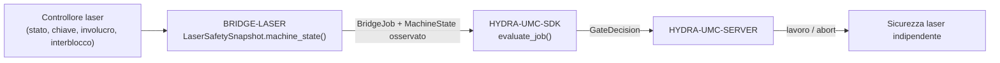

<!-- =============================================================================
HYDRA-UMC-BRIDGE-LASER - Ponte di coordinamento cella laser
Copyright (C) 2026 JuanenRac (Electro Hobby 3D) <electrohobby3d@gmail.com>
GPL-3.0-or-later - see LICENSE
============================================================================= -->

<p align="center">
  
</p>

# 🔦 HYDRA-UMC-BRIDGE-LASER

<p align="center"><a href="README.md">🇺🇸 English</a> | <a href="README_spa.md">🇪🇸 Español</a> | <a href="README_fra.md">🇫🇷 Français</a> | 🇮🇹 <b>Italiano</b> | <a href="README_deu.md">🇩🇪 Deutsch</a> | <a href="README_zho.md">🇨🇳 简体中文</a> | <a href="README_jpn.md">🇯🇵 日本語</a></p>

### 🛑 Ponte di coordinamento fail-safe per celle laser

<p align="left">
  
  
  
</p>

---

## 1. 🛠️ PANORAMICA TECNICA

**HYDRA-UMC-BRIDGE-LASER** è il ponte di alto livello per celle laser e ausiliari robotici HYDRA-UMC. Può coordinare attività periferiche sicure come il trasferimento di materiale, ma non può **mai** armare, attivare o scavalcare un controllore laser — quelle condizioni sono osservazioni che legge, non autorità che detiene.

Appartiene alla famiglia **External Automation Bridges**: un insieme di repository fratelli (CNC, LASER, OPENPNP, PRINTER3D, ROS2) che condividono lo stesso contratto di sicurezza di `HYDRA-UMC-SDK`, così nessun ponte può inventare una propria definizione di "sicuro per lavorare".

### Caratteristiche principali:
* ✅ **Snapshot di sicurezza a quattro segnali, reale:** `cell.py` — `LaserSafetySnapshot.machine_state()` richiede che la chiave sia abilitata, l'involucro chiuso **e** l'interblocco sano contemporaneamente; se anche solo uno manca, si risolve in `SAFE_STOP` ancor prima di leggere `controller_state`. *(implementato, testato in `tests/test_cell.py`)*
* ✅ **Porta di sicurezza condivisa, reale:** ogni lavoro osservato viene rivalutato tramite `evaluate_job()` del `bridge_contract` di `HYDRA-UMC-SDK`, la stessa porta usata da tutti i ponti fratelli e da HYDRA-UMC-SERVER. *(implementato)*
* ✅ **Mappatura di stato conservativa:** solo `IDLE` è trattato come riposo; `RUN`/`RUNNING`/`PAUSED` vengono mappati su `RUNNING`, `FAULT`/`ALARM`/`ERROR` su `FAULT`, e qualsiasi valore non riconosciuto ricade su `OFFLINE`. *(implementato)*
* ✅ **Evidenza di sicurezza in sola lettura:** `observation.py` accetta solo segnali booleani genuini per chiave, involucro e interblocco; valori mancanti, numerici o di tipo testo falliscono in modo sicuro. Non può armare né azionare un laser. *(implementato, testato in `tests/test_observation.py`)*
* ✅ **Lettura GPIO reale e neutrale rispetto al controllore:** `GpioSafetyProbe` di `gpio_safety.py` legge le stesse 3 protezioni indipendenti da vere linee GPIO (libgpiod v2) invece che da una mappatura salvata - deliberatamente agnostico rispetto al controllore, poiché un interruttore a chiave/sensore porta/relè di interblocco è universale sulle taglierine laser indipendentemente dalla marca. Un fallimento di lettura GPIO fa fallire in modo sicuro tutte e 3 le protezioni. *(implementato, testato in `tests/test_gpio_safety.py`)*
* ✅ **Build/test non mutante:** `build-test.bat`/`.sh` compilano il codice sorgente ed eseguono la suite di test della porta di sicurezza senza toccare i file di versione o il CHANGELOG. *(implementato, vedi COMPILAZIONE ED ESECUZIONE più sotto)*
* 🔜 **Integrazione concreta con controllore/software laser** — deliberatamente rimandata fino a quando la macchina e la sua interfaccia documentata non saranno disponibili. *(pianificato)*

---

## 2. 🔄 FLUSSO DI COORDINAMENTO DELLA CELLA



---

## 3. 🧱 ARCHITETTURA E DECISIONI DI PROGETTAZIONE

* **Perché quattro osservazioni di sicurezza indipendenti invece di un solo booleano.** `LaserSafetySnapshot.machine_state()` verifica `key_enabled`, `enclosure_closed` e `interlock_healthy` come tre condizioni separate — la sicurezza laser reale richiede che ogni protezione fisica sia indipendentemente vera; ridurle a un solo flag nasconderebbe quale di esse è effettivamente fallita.
* **Perché il ponte documenta che non può mai armare né attivare un laser.** Il docstring stesso di `LaserCellBridge` afferma che "coordina solo ausiliari esterni; non può armare né attivare un laser" — quelle condizioni sono osservazioni degli stessi interblocchi certificati del controllore, mai un loro sostituto.
* **Perché la mappatura dello stato del controllore è deliberatamente conservativa.** Solo la stringa letterale `IDLE` viene mappata su `MachineState.IDLE`. Qualsiasi valore non riconosciuto ricade su `OFFLINE`, mai su qualcosa che permetterebbe lavoro ausiliario.
* **Perché il ponte costruisce un nuovo `BridgeJob` e delega al `evaluate_job()` condiviso invece di scrivere una propria logica di accettazione/rifiuto.** Tutti e cinque gli External Automation Bridges (CNC, LASER, OPENPNP, PRINTER3D, ROS2) riutilizzano esattamente lo stesso `bridge_contract` di `HYDRA-UMC-SDK`, così "cosa conta come sicuro per avviare un lavoro" non può divergere silenziosamente tra loro.
* **Perché la scelta del software/controllore laser reale è deliberatamente rimandata.** Vincolarsi all'interfaccia di un fornitore specifico prima che la macchina e la sua segnalazione documentata degli interblocchi siano disponibili significherebbe affermare una garanzia di sicurezza reale che questo nucleo locale non può verificare.
* **Come si inserisce nel resto dell'ecosistema.** BRIDGE-LASER si trova tra il controllore laser e `HYDRA-UMC-SDK` → `HYDRA-UMC-SERVER` → sicurezza indipendente: coordina il lavoro robotico ausiliario attorno alla cella laser, non sostituisce né annulla la sicurezza laser certificata.

---

## 📂 STRUTTURA DELLE DIRECTORY

```text
HYDRA-UMC-BRIDGE-LASER/
├── src/
│   └── hydra_umc_bridge_laser/
│       ├── __init__.py
│       ├── cell.py              # Porta di sicurezza LaserSafetySnapshot + LaserCellBridge
│       ├── observation.py       # Normalizzazione in sola lettura dell'evidenza di sicurezza
│       ├── gpio_safety.py       # Legge i 3 segnali di sicurezza reali e indipendenti via GPIO - mai un comando laser
│       └── mqtt_transport.py    # Trasporto MQTT reale - solo stato/evidenza, questo bridge non può armare né sparare un laser
├── tests/
│   ├── test_cell.py             # Ammissione in riposo sicuro, rifiuto involucro, inoltro abort
│   ├── test_observation.py      # L'evidenza di sicurezza mancante fallisce fail-closed
│   ├── test_gpio_safety.py      # Letture GPIO di sicurezza reali contro un chip fittizio, incl. percorsi fail-closed
│   └── test_mqtt_transport.py   # Test di forma stato/evidenza MQTT contro un client broker fittizio
├── tools/
│   ├── build_test.py            # Compilatore + esecutore di test non mutante (build-test.bat/.sh)
│   └── bump_version.py          # Sincronizza pyproject.toml, manifesto e CHANGELOG.md
├── docs/
│   ├── BRIDGE_GUIDE.md                    # Ambito, piattaforme compatibili, script, porta di accettazione hardware
│   └── CONTROLLER_EVIDENCE_BOUNDARY.md    # Cosa conta come evidenza di sicurezza reale e cosa questo bridge rifiuta di dedurre
├── images/
│   └── HYDRA_UMC_BANNER.svg     # Banner del README
├── build-test.bat / build-test.sh  # Solo valida, non modifica mai il repository
├── build.bat / build.sh            # Valida e, solo in caso di successo, aggiorna versione + CHANGELOG
├── pyproject.toml               # Metadati del pacchetto; dipende da HYDRA-UMC-SDK (git)
├── hydra-umc.project.json       # Manifesto dell'ecosistema (versione, maturità, famiglia)
├── CHANGELOG.md
├── CODE_OF_CONDUCT.md / CONTRIBUTING.md / SECURITY.md / SUPPORT.md
├── LICENSE / LICENSE.md
└── README.md / README_*.md      # Questo file e le sue 6 traduzioni
```

---

## 4. ⚙️ COMPILAZIONE ED ESECUZIONE

Richiede Python 3.11+. `tools/build_test.py` si aspetta che `HYDRA-UMC-SDK` sia clonato come directory fratella (`../HYDRA-UMC-SDK`) o indicato tramite la variabile d'ambiente `HYDRA_UMC_SDK_ROOT`.

```bash
# Windows
build-test.bat      # solo validazione — nessun cambio di versione/CHANGELOG
build.bat            # valida e, se ha successo, aggiorna versione + CHANGELOG

# Linux/macOS
bash build-test.sh
bash build.sh
```

`build-test` compila ogni modulo sotto `src/` con `py_compile` ed esegue l'intera suite `unittest` (`tests/test_cell.py`), dimostrando l'ammissione in riposo sicuro, il rifiuto involucro e l'inoltro dell'abort — non modifica mai il repository. `build` esegue prima quella stessa validazione e, solo in caso di successo, chiama `tools/bump_version.py` per sincronizzare la versione in `pyproject.toml`, `hydra-umc.project.json` e `CHANGELOG.md`. Non esiste ancora un comando `run` laser reale — serve un'integrazione del controllore validata e sicura.

---

## ✅ STATO ATTUALE E PROSSIMI PASSI

**Reale oggi:** versione `0.0.7`, un nucleo di pianificazione fail-safe testato in locale (`LaserSafetySnapshot` + `LaserCellBridge`) appoggiato sulla porta di lavoro condivisa di `HYDRA-UMC-SDK`, normalizzazione rigorosa e in sola lettura dell'evidenza di sicurezza che distingue un lavoro realmente in pausa (`HOLDING`) da uno realmente in taglio (`RUNNING`), una lettura GPIO reale e neutrale rispetto al controllore (`GpioSafetyProbe`) per le 3 protezioni indipendenti chiave/involucro/interblocco, una suite `unittest` deterministica di ventisette test, e script build-test non mutanti collegati alla CI con checkout dell'SDK.

**Confine di integrazione:** l'involucro, la chiave e l'interblocco certificati del controllore laser stesso non vengono mai aggirati; questo ponte regola solo il lavoro robotico *ausiliario* attorno ad esso, e solo leggendo il suo stato riportato.

**Ancora da fare:** il ponte non è stato collegato né usato per far funzionare un sistema laser reale — scegliere e validare un'interfaccia concreta di controllore/software è rimandato fino alla disponibilità della macchina e della sua interfaccia documentata.

---

## 🔗 Progetti Correlati

Questo progetto fa parte dell'ecosistema robotico HYDRA-UMC dello stesso autore (JuanenRac / Electro Hobby 3D). Vale la pena conoscerlo, poiché una richiesta potrebbe in realtà riguardare uno di questi invece di questo repository.

**Progetto Padre**
- **[HYDRA-UMC-SERVER](https://github.com/JuanenRac/HYDRA-UMC-SERVER)** — il vero backend headless (REST/WebSocket) con cui parla davvero ogni client di controllo; il confine autenticato dell'ecosistema a cui questo bridge riporta una volta che ogni comando ha superato la barriera di sicurezza locale di questo stesso bridge.

**Progetti Fratelli** — parlano anch'essi con la stessa API di HYDRA-UMC-SERVER, ciascuno come proprio client
- **[HYDRA-UMC-STUDIO](https://github.com/JuanenRac/HYDRA-UMC-STUDIO)** — dashboard di controllo web con visualizzazione 3D multi-robot in tempo reale.
- **[HYDRA-UMC-SUITE](https://github.com/JuanenRac/HYDRA-UMC-SUITE)** — centro di comando sciame desktop (PySide6) per più server contemporaneamente, pacchettizzato come eseguibile standalone.
- **[HYDRA-UMC-ANDROID-CONTROL](https://github.com/JuanenRac/HYDRA-UMC-ANDROID-CONTROL)** — app di controllo nativa per Android con login biometrico e un companion Wear OS abbinato.
- **[HYDRA-UMC-IOS-CONTROL](https://github.com/JuanenRac/HYDRA-UMC-IOS-CONTROL)** — app di controllo per iOS/iPadOS (Flutter) con sincronizzazione WebSocket in tempo reale.
- **[HYDRA-UMC-DSI](https://github.com/JuanenRac/HYDRA-UMC-DSI)** — interfaccia touch nativa per il touchscreen DSI da 7" a bordo, incorporata direttamente nel CM5.
- **[HYDRA-UMC-BRIDGE-AMR](https://github.com/JuanenRac/HYDRA-UMC-BRIDGE-AMR)** — barriera di coordinamento per flotte AGV/AMR tramite un publisher MQTT VDA 5050 reale.
- **[HYDRA-UMC-BRIDGE-CNC](https://github.com/JuanenRac/HYDRA-UMC-BRIDGE-CNC)** — coordinatore ad alto livello per celle CNC con accesso reale a stato/byte di controllo GRBL.
- **[HYDRA-UMC-BRIDGE-DROIDS](https://github.com/JuanenRac/HYDRA-UMC-BRIDGE-DROIDS)** — barriera di coordinamento per droidi con zampe/umanoidi, con un vero mittente di comandi per Boston Dynamics Spot.
- **[HYDRA-UMC-BRIDGE-OPENPNP](https://github.com/JuanenRac/HYDRA-UMC-BRIDGE-OPENPNP)** — coordinatore ad alto livello sicuro per il flusso schede del pick-and-place OpenPnP.
- **[HYDRA-UMC-BRIDGE-PRINTER3D](https://github.com/JuanenRac/HYDRA-UMC-BRIDGE-PRINTER3D)** — barriera di coordinamento sicura per stampanti 3D Moonraker/Klipper, con comandi di lavoro reali e controllati.
- **[HYDRA-UMC-BRIDGE-ROS2](https://github.com/JuanenRac/HYDRA-UMC-BRIDGE-ROS2)** — coordinatore di sicurezza con un vero trasporto ROS 2 rclpy, importato in modo lazy.
- **[HYDRA-UMC-BRIDGE-UAV](https://github.com/JuanenRac/HYDRA-UMC-BRIDGE-UAV)** — barriera di coordinamento per UAV dotati di fotocamera, con un vero mittente di comandi MAVLink.

**Direttamente Correlati**
- **[HYDRA-UMC-SDK](https://github.com/JuanenRac/HYDRA-UMC-SDK)** — il contratto JSON-Schema condiviso e la barriera di sicurezza contro cui ogni bridge valida i propri comandi.
- **[HYDRA-UMC-MQTT-BROKER](https://github.com/JuanenRac/HYDRA-UMC-MQTT-BROKER)** — il vero trasporto di `mqtt_transport.py` per i propri topic `hydra/bridges/laser/...` di questo bridge — solo stato delle salvaguardie, poiché qui non esiste alcun comando reale di azionamento (questo bridge non può armare né attivare un laser in alcun caso); vedi il proprio `docs/BRIDGE_TOPICS.md` di quel repository.
- **[HYDRA-UMC-SAFETY-ZONES](https://github.com/JuanenRac/HYDRA-UMC-SAFETY-ZONES)** — futura evidenza di sicurezza della zona cella per questo bridge.

**Fa Anche Parte dell'Ecosistema**

*Hardware e Piattaforma di Base*
- **[HYDRA-UMC](https://github.com/JuanenRac/HYDRA-UMC)** — la scheda madre fisica del braccio robotico: host CM5 + coprocessore STM32H745 dual-core, che coordina fino a 8 bracci utensile via CAN-OTA/SPI-OTA.
- **[HYDRA-UMC-OS](https://github.com/JuanenRac/HYDRA-UMC-OS)** — livello prodotto riproducibile su Raspberry Pi OS per il CM5: agente in sola lettura, config/profili validati, provisioning WiFi al primo contatto.

*Backend Centrale e Client*
- **[HYDRA-UMC-EDITOR-URDF](https://github.com/JuanenRac/HYDRA-UMC-EDITOR-URDF)** — creatore/editor grafico desktop di URDF che invia i modelli finiti al catalogo di STUDIO.

*Piattaforma Strumenti URTC*
- **[URTC](https://github.com/JuanenRac/URTC)** — firmware per la scheda fisica dell'Universal Robot Tool Controller, oltre 25 profili utensile su bus CAN.
- **[URTC-FLASHER](https://github.com/JuanenRac/URTC-FLASHER)** — strumento desktop con GUI per il flashing delle schede URTC, CAN-OTA più SWD/JTAG a chip intero.
- **[URTC-TESTER](https://github.com/JuanenRac/URTC-TESTER)** — strumento desktop di diagnostica CAN-bus dal vivo per schede URTC, un pannello per profilo utensile.
- **[URTC-WEB-STUDIO](https://github.com/JuanenRac/URTC-WEB-STUDIO)** — alternativa basata su browser a URTC-TESTER tramite la Web Serial API, senza installazione locale.

*Nodo IA Visione (Hailo-8)*
- **[HYDRA-UMC-VISION-NODE](https://github.com/JuanenRac/HYDRA-UMC-VISION-NODE)** — hub di integrazione per la pipeline di visione Hailo-8, con un vero controllo di prontezza hardware per fase.
- **[HYDRA-UMC-DETECTION-HEF](https://github.com/JuanenRac/HYDRA-UMC-DETECTION-HEF)** — registro reale di modelli compilati con verifica di caricamento sicuro per architettura Hailo/checksum.
- **[HYDRA-UMC-VISION-STREAMER](https://github.com/JuanenRac/HYDRA-UMC-VISION-STREAMER)** — generatore reale di pipeline GStreamer + config MediaMTX, con una vera barriera di integrazione HailoRT.
- **[HYDRA-UMC-VISUAL-SERVOING-API](https://github.com/JuanenRac/HYDRA-UMC-VISUAL-SERVOING-API)** — vera legge di correzione Position-Based Visual Servoing, con cancello di sicurezza sullo stato di zona a monte.

*Nodo IA Cognitivo (Hailo-10)*
- **[HYDRA-UMC-COGNITIVE-NODE](https://github.com/JuanenRac/HYDRA-UMC-COGNITIVE-NODE)** — hub di integrazione per la pipeline cognitiva Hailo-10 (orchestrazione LLM/VLA/voce).
- **[HYDRA-UMC-VLA-ENGINE](https://github.com/JuanenRac/HYDRA-UMC-VLA-ENGINE)** — vera codifica/decodifica di token d'azione e generazione di traiettoria per un modello Vision-Language-Action.
- **[HYDRA-UMC-VOICE-UI](https://github.com/JuanenRac/HYDRA-UMC-VOICE-UI)** — vero front-end vocale (VAD + parser di intenti) con un relay verso Watch limitato e soggetto a conferma.
- **[HYDRA-UMC-SEMANTIC-PLANNER](https://github.com/JuanenRac/HYDRA-UMC-SEMANTIC-PLANNER)** — vera scomposizione dei task basata su regole e recupero semantico degli errori sui codici errore MCU.
- **[HYDRA-UMC-DOCS-QA](https://github.com/JuanenRac/HYDRA-UMC-DOCS-QA)** — vera ricerca documentale TF-IDF (solo libreria standard) sui documenti Markdown di questo ecosistema.

*Orchestrazione e Sciame*
- **[HYDRA-UMC-ORCHESTRATOR](https://github.com/JuanenRac/HYDRA-UMC-ORCHESTRATOR)** — hub di integrazione con un vero contratto di health-report gRPC/Protobuf e una macchina a stati di missione.
- **[HYDRA-UMC-JOB-DISPATCHER](https://github.com/JuanenRac/HYDRA-UMC-JOB-DISPATCHER)** — vera coda di lavori basata su priorità con deduplicazione, su una vera API HTTP.
- **[HYDRA-UMC-NODE-HEALING](https://github.com/JuanenRac/HYDRA-UMC-NODE-HEALING)** — vero watchdog di salute della flotta basato su gRPC, con retry/backoff e rilevamento di discrepanza d'identità.
- **[HYDRA-UMC-PATH-PLANNER-3D](https://github.com/JuanenRac/HYDRA-UMC-PATH-PLANNER-3D)** — vero pianificatore di percorsi 3D basato su RRT, con vera validazione delle collisioni ostacolo/spazio di lavoro.
- **[HYDRA-UMC-SWARM-SYNC](https://github.com/JuanenRac/HYDRA-UMC-SWARM-SYNC)** — vera sincronizzazione di stato CRDT LWW-Element-Map, con property test per la convergenza multi-cella.

*Gemello Digitale e Simulazione*
- **[HYDRA-UMC-TWIN](https://github.com/JuanenRac/HYDRA-UMC-TWIN)** — hub di integrazione per il motore di gemello digitale, con un vero contratto di sincronizzazione per compatibilità di versione.
- **[HYDRA-UMC-HIL-BRIDGE](https://github.com/JuanenRac/HYDRA-UMC-HIL-BRIDGE)** — vero interblocco di sicurezza hardware-in-the-loop che instrada i comandi tra simulazione e hardware reale.
- **[HYDRA-UMC-PHYSICS-REPLICA](https://github.com/JuanenRac/HYDRA-UMC-PHYSICS-REPLICA)** — vera cinematica diretta e validazione dei limiti articolari su un vero sottoinsieme URDF.
- **[HYDRA-UMC-SYNTHETIC-DATA-GEN](https://github.com/JuanenRac/HYDRA-UMC-SYNTHETIC-DATA-GEN)** — vero generatore procedurale di scene 2D con esportazione di annotazioni YOLO/COCO.

*Dati e Analisi*
- **[HYDRA-UMC-DATALAKE](https://github.com/JuanenRac/HYDRA-UMC-DATALAKE)** — vero archivio di serie temporali basato su sqlite3, con una vera API HTTP di ingestione/query.
- **[HYDRA-UMC-ANOMALY-DETECTOR](https://github.com/JuanenRac/HYDRA-UMC-ANOMALY-DETECTOR)** — vero rilevatore di anomalie FFT + baseline statistica, con monitoraggio della deriva.
- **[HYDRA-UMC-PRODUCTION-REPORTS](https://github.com/JuanenRac/HYDRA-UMC-PRODUCTION-REPORTS)** — vero calcolo OEE/disponibilità sullo storico di DATALAKE, con esportazione CSV riproducibile.
- **[HYDRA-UMC-TELEMETRY-COLLECTOR](https://github.com/JuanenRac/HYDRA-UMC-TELEMETRY-COLLECTOR)** — vera pipeline di ingestione CAN/WebSocket verso DATALAKE, con deduplicazione per sequenza.

*Gateway Industriale*
- **[HYDRA-UMC-GATEWAY-INDUSTRIAL](https://github.com/JuanenRac/HYDRA-UMC-GATEWAY-INDUSTRIAL)** — hub di integrazione che inoltra ai protocolli industriali, con un vero livello di allowlist dei comandi/backpressure.
- **[HYDRA-UMC-OPCUA-SERVER](https://github.com/JuanenRac/HYDRA-UMC-OPCUA-SERVER)** — vero spazio di indirizzi OPC-UA, verificato con una vera sessione client del protocollo binario.
- **[HYDRA-UMC-MTCONNECT-ADAPTER](https://github.com/JuanenRac/HYDRA-UMC-MTCONNECT-ADAPTER)** — veri endpoint XML `/probe` e `/current` di MTConnect, con output in modalità degradata.

*Strumenti Complementari e Operazioni dell'Ecosistema*
- **[HYDRA-UMC-DASHBOARD-AI](https://github.com/JuanenRac/HYDRA-UMC-DASHBOARD-AI)** — pannelli Smart Summaries e Anomaly Highlighting su DATALAKE/ANOMALY-DETECTOR, con un fallback statistico onesto.
- **[HYDRA-UMC-TOOL-CLI](https://github.com/JuanenRac/HYDRA-UMC-TOOL-CLI)** — CLI di flotta con un vero e stabile contratto di exit-code, un client live reale della stessa API di HYDRA-UMC-SERVER.
- **[HYDRA-UMC-WATCH](https://github.com/JuanenRac/HYDRA-UMC-WATCH)** — app companion WearOS con avvisi aptici reali e un relay vocale verso il telefono abbinato.
- **[URTC-SMART-RACK](https://github.com/JuanenRac/URTC-SMART-RACK)** — firmware per un rack di montaggio schede con decodifica reale dell'ID utensile e logica di preriscaldamento Smart Idle.
- **[URTC-VISION-TOOL](https://github.com/JuanenRac/URTC-VISION-TOOL)** — firmware più un vero companion di visione Python per una testa utensile di ispezione termica/RGB.
- **[HYDRA-UMC-UPDATER](https://github.com/JuanenRac/HYDRA-UMC-UPDATER)** — strumento amministrativo desktop che scopre, clona e aggiorna ogni repository di questo ecosistema.

---

## 📚 Documentazione e Comunità

- **[CONTRIBUTING.md](CONTRIBUTING.md)** — stack tecnologico e linee guida di codifica per una pull request.
- **[CODE_OF_CONDUCT.md](CODE_OF_CONDUCT.md)** — gli standard di comportamento attesi in questa comunità.
- **[SECURITY.md](SECURITY.md)** — come segnalare una vulnerabilità, e le reali aree di attenzione sulla sicurezza di questo progetto.
- **[SUPPORT.md](SUPPORT.md)** — dove porre domande e segnalare bug.
- **[LICENSE.md](LICENSE.md)** — la licenza propria di questo progetto.

## 👤 AUTORE
**JuanenRac** (Electro Hobby 3D)
📧 electrohobby3d@gmail.com
📺 [youtube.com/@electrohobby3d](https://youtube.com/@electrohobby3d)

## 📜 LICENZA
GPL-3.0 - Vedi LICENSE per i dettagli.
