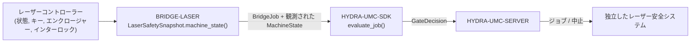

<!-- =============================================================================
HYDRA-UMC-BRIDGE-LASER - レーザーセル連携ブリッジ
Copyright (C) 2026 JuanenRac (Electro Hobby 3D) <electrohobby3d@gmail.com>
GPL-3.0-or-later - see LICENSE
============================================================================= -->

<p align="center">
  
</p>

# 🔦 HYDRA-UMC-BRIDGE-LASER

<p align="center"><a href="README.md">🇺🇸 English</a> | <a href="README_spa.md">🇪🇸 Español</a> | <a href="README_fra.md">🇫🇷 Français</a> | <a href="README_ita.md">🇮🇹 Italiano</a> | <a href="README_deu.md">🇩🇪 Deutsch</a> | <a href="README_zho.md">🇨🇳 简体中文</a> | 🇯🇵 <b>日本語</b></p>

### 🛑 レーザーセル向けフェイルセーフ連携ブリッジ

<p align="left">
  
  
  
</p>

---

## 1. 🛠️ 技術概要

**HYDRA-UMC-BRIDGE-LASER** は、レーザーセルとHYDRA-UMCロボット補助装置とを結ぶ高レベルブリッジである。材料の受け渡しなど安全な周辺タスクを連携させることはできるが、レーザーコントローラーを解除・発振・上書きすることは**決してない**。それらは読み取る観測値であって、保持する権限ではない。

本リポジトリは **External Automation Bridges** ファミリーに属する。CNC・LASER・OPENPNP・PRINTER3D・ROS2という兄弟リポジトリ群が、すべて `HYDRA-UMC-SDK` の同じ安全契約を共有しており、いずれのブリッジも独自の「作業に安全」という定義を勝手に作ることはできない。

### 主な機能:
* ✅ **実在する4信号の安全スナップショット:** `cell.py` の `LaserSafetySnapshot.machine_state()` は、キースイッチが有効、エンクロージャーが閉じている、**かつ**インターロックが正常であることを同時に要求する —— いずれか一つでも欠けると、`controller_state` を読む前に `SAFE_STOP` へ解決される。*(実装済み、`tests/test_cell.py` でテスト済み)*
* ✅ **実在する共有安全ゲート:** 観測されたすべてのジョブは `HYDRA-UMC-SDK` の `bridge_contract` にある `evaluate_job()` を通じて再評価される。これは他のすべての兄弟ブリッジとHYDRA-UMC-SERVERが使うのと同じゲートである。*(実装済み)*
* ✅ **保守的な状態マッピング:** `IDLE` のみがアイドルとして扱われる。`RUN`/`RUNNING`/`PAUSED` は `RUNNING` に、`FAULT`/`ALARM`/`ERROR` は `FAULT` にマッピングされ、認識されない値はすべて `OFFLINE` にフォールバックする。*(実装済み)*
* ✅ **読み取り専用の安全性実証:** `observation.py` はキー、エンクロージャー、インターロックの本物のブール信号のみを受け入れる。欠落・数値型・テキスト型の値は安全側に倒れて失敗する。レーザーをアームしたり発射したりすることはできない。*(実装済み、`tests/test_observation.py` でテスト済み)*
* ✅ **実際の、コントローラーに依存しない GPIO インターロック読み取り:** `gpio_safety.py` の `GpioSafetyProbe` は、保存されたマッピングではなく実際の GPIO ライン（libgpiod v2）から同じ3つの独立した保護機構を読み取る —— キースイッチ／ドアセンサー／インターロックリレーはブランドを問わずレーザーカッターに共通するため、意図的にコントローラーに依存しない設計になっている。GPIO の読み取りに失敗した場合、3つの保護機構すべてが安全側に倒れて失敗する。*(実装済み、`tests/test_gpio_safety.py` でテスト済み)*
* ✅ **非破壊的なビルド/テスト:** `build-test.bat`/`.sh` はソースをコンパイルし、バージョンファイルやCHANGELOGに一切触れずに安全ゲートのテストスイートを実行する。*(実装済み、下記「ビルドと実行」を参照)*
* 🔜 **具体的なレーザーコントローラー/ソフトウェア統合** —— 実機とその文書化されたインターフェースが揃うまで意図的に保留されている。*(計画中)*

---

## 2. 🔄 セル連携フロー



---

## 3. 🧱 アーキテクチャと設計判断

* **なぜ単一のブール値ではなく4つの独立した安全観測値を使うのか。** `LaserSafetySnapshot.machine_state()` は `key_enabled`、`enclosure_closed`、`interlock_healthy` を3つの独立した条件として検証する —— 実際のレーザー安全は、それぞれの物理的な安全対策が独立して真であることを必要とする。これらを1つのフラグにまとめてしまうと、実際にどれが失敗したのかが隠れてしまう。
* **なぜブリッジはレーザーを決して解除・発振できないと明記しているのか。** `LaserCellBridge` 自身のドキュメント文字列には「外部補助装置のみを連携させる。レーザーを解除・発振することはできない」と記されている —— これらの条件はコントローラー自身の認証済みインターロックの観測値であり、それらの代替では決してない。
* **なぜコントローラー状態のマッピングを意図的に保守的にしているのか。** 文字列 `IDLE` のみが `MachineState.IDLE` にマッピングされる。認識されない値はすべて `OFFLINE` にフォールバックし、補助作業を許可してしまうような状態には決してならない。
* **なぜブリッジは新しい `BridgeJob` を組み立て、独自の受理/拒否ロジックを書く代わりに共有の `evaluate_job()` に委譲するのか。** 5つのExternal Automation Bridges(CNC、LASER、OPENPNP、PRINTER3D、ROS2)はすべて `HYDRA-UMC-SDK` の全く同じ `bridge_contract` を再利用しており、「何をもってジョブ開始が安全とみなすか」がそれぞれの間で静かに食い違うことがない。
* **なぜ実際のレーザーソフトウェア/コントローラーの選定が意図的に保留されているのか。** 実機とその文書化されたインターロック報告が揃う前に特定ベンダーのインターフェースに縛られることは、このローカルコアが検証できない実際の安全保証を主張することになってしまう。
* **エコシステムの他部分とどう関係するか。** BRIDGE-LASERはレーザーコントローラーと `HYDRA-UMC-SDK` → `HYDRA-UMC-SERVER` → 独立した安全システムとの間に位置する。レーザーセルの周辺で補助ロボット作業を調整するものであり、認証済みのレーザー安全システムを置き換えたり上書きしたりすることはない。

---

## 📂 ディレクトリ構成

```text
HYDRA-UMC-BRIDGE-LASER/
├── src/
│   └── hydra_umc_bridge_laser/
│       ├── __init__.py
│       └── cell.py              # LaserSafetySnapshot + LaserCellBridge 安全ゲート
├── tests/
│   └── test_cell.py             # 安全アイドル許可、エンクロージャー拒否、中止転送
├── tools/
│   ├── build_test.py            # 非破壊的なコンパイル+テストランナー (build-test.bat/.sh)
│   └── bump_version.py          # pyproject.toml、マニフェスト、CHANGELOG.md を同期
├── build-test.bat / build-test.sh  # 検証のみ、リポジトリを一切変更しない
├── build.bat / build.sh            # 検証後、成功時のみバージョン + CHANGELOG を更新
├── pyproject.toml               # パッケージメタデータ。HYDRA-UMC-SDK に依存 (git)
├── hydra-umc.project.json       # エコシステムマニフェスト(バージョン、成熟度、ファミリー)
├── CHANGELOG.md
├── CODE_OF_CONDUCT.md / CONTRIBUTING.md / SECURITY.md / SUPPORT.md
├── LICENSE / LICENSE.md
└── README.md / README_*.md      # 本ファイルおよびその6言語訳
```

---

## 4. ⚙️ ビルドと実行

Python 3.11以上が必要。`tools/build_test.py` は `HYDRA-UMC-SDK` が兄弟ディレクトリ(`../HYDRA-UMC-SDK`)としてチェックアウトされているか、環境変数 `HYDRA_UMC_SDK_ROOT` で指定されていることを期待する。

```bash
# Windows
build-test.bat      # 検証のみ —— バージョン/CHANGELOGの変更なし
build.bat            # 検証後、成功時にバージョン + CHANGELOG を更新

# Linux/macOS
bash build-test.sh
bash build.sh
```

`build-test` は `src/` 配下の各モジュールを `py_compile` でコンパイルし、`unittest` の全スイート(`tests/test_cell.py`)を実行して、安全アイドル許可、エンクロージャー拒否、中止転送を実証する —— リポジトリを一切変更しない。`build` はまず同じ検証を実行し、成功した場合のみ `tools/bump_version.py` を呼び出して `pyproject.toml`、`hydra-umc.project.json`、`CHANGELOG.md` の間でバージョンを同期する。実際のレーザー向け `run` コマンドはまだ存在しない —— それには検証済みで安全なコントローラー統合が必要である。

---

## ✅ 現状と次のステップ

**現時点で実在するもの:** バージョン `0.0.4`。ローカルでテスト済みのフェイルセーフな計画コア(`LaserSafetySnapshot` + `LaserCellBridge`)が `HYDRA-UMC-SDK` の共有ジョブゲートの上に構築されており、厳密な読み取り専用安全証拠の正規化、決定論的な9件の `unittest` スイートと、SDKチェックアウトを伴いCIに組み込まれた非破壊的なbuild-testスクリプトを備える。

**統合境界:** レーザーコントローラー自身の認証済みエンクロージャー、キースイッチ、インターロック権限は決してバイパスされない。このブリッジが調整するのはあくまでその周辺の*補助的な*ロボット作業のみであり、それもコントローラーが報告する状態を読み取ることによってのみ行う。

**今後の課題:** 本ブリッジはまだ実際のレーザーシステムに接続されたり、それを操作するために使われたりしていない —— 具体的なコントローラー/ソフトウェアインターフェースの選定と検証は、実機とその文書化されたインターフェースが揃うまで保留されている。

---

## 🔗 関連プロジェクト

本プロジェクトは、同じ著者(JuanenRac / Electro Hobby 3D)によるより大きなロボティクス・エコシステムの一部であり、ファームウェア、制御ソフトウェア、AIノード、フリート管理ツールにまたがる。リクエストが実際には本リポジトリではなくこれらのいずれかに関するものである可能性があるため、知っておく価値がある。

### 直接関連

- **[HYDRA-UMC-SDK](https://github.com/JuanenRac/HYDRA-UMC-SDK)** —— このブリッジ(および他のすべてのブリッジ)がジョブを評価する共有の `bridge_contract` ジョブゲート。
- **[HYDRA-UMC-SERVER](https://github.com/JuanenRac/HYDRA-UMC-SERVER)** —— このブリッジが報告する認可済みセル境界。
- **[HYDRA-UMC-MQTT-BROKER](https://github.com/JuanenRac/HYDRA-UMC-MQTT-BROKER)** —— このブリッジ自身の `hydra/bridges/laser/...` トピック（保護状態＋共有ジョブゲート — ここには実際の作動コマンドは存在せず、このブリッジもレーザーをアーム／発射することはできない）向けの `mqtt_transport.py` による実際のトランスポート - 詳細はそのリポジトリ自身の `docs/BRIDGE_TOPICS.md` を参照。
- **[HYDRA-UMC-SAFETY-ZONES](https://github.com/JuanenRac/HYDRA-UMC-SAFETY-ZONES)** —— 将来のセルゾーン安全実証。

### エコシステムのその他

**HYDRA-UMCプラットフォーム** —— このブリッジが補助機能を調整するマルチロボット・マイクロファクトリー
- **[HYDRA-UMC](https://github.com/JuanenRac/HYDRA-UMC)** —— 最大8本のロボットアームを統括するCM5 + STM32H745マザーボード。
- **[HYDRA-UMC-SERVER](https://github.com/JuanenRac/HYDRA-UMC-SERVER)** —— すべての制御クライアントとブリッジが通信するExpress/WebSocketバックエンド。
- **[HYDRA-UMC-STUDIO](https://github.com/JuanenRac/HYDRA-UMC-STUDIO)** —— Webベースの制御ダッシュボード、マルチロボット3D可視化。

**External Automation Bridges** —— 同じ `HYDRA-UMC-SDK` ジョブゲートを共有する兄弟リポジトリ群
- **[HYDRA-UMC-BRIDGE-CNC](https://github.com/JuanenRac/HYDRA-UMC-BRIDGE-CNC)** —— CNCセル連携ブリッジ。
- **[HYDRA-UMC-BRIDGE-OPENPNP](https://github.com/JuanenRac/HYDRA-UMC-BRIDGE-OPENPNP)** —— OpenPnP向けボードフローブリッジ。
- **[HYDRA-UMC-BRIDGE-PRINTER3D](https://github.com/JuanenRac/HYDRA-UMC-BRIDGE-PRINTER3D)** —— オープンな3Dプリントソフトウェア向け連携ブリッジ。
- **[HYDRA-UMC-BRIDGE-ROS2](https://github.com/JuanenRac/HYDRA-UMC-BRIDGE-ROS2)** —— ROS 2との双方向連携境界。

**安全・統合の実証**
- **[HYDRA-UMC-SAFETY-ZONES](https://github.com/JuanenRac/HYDRA-UMC-SAFETY-ZONES)** —— ブリッジファミリー全体で使われるセルゾーンの安全実証。
- **[HYDRA-UMC-HIL-BRIDGE](https://github.com/JuanenRac/HYDRA-UMC-HIL-BRIDGE)** —— ハードウェア・イン・ザ・ループのテスト実証。

## 👤 作者
**JuanenRac** (Electro Hobby 3D)
📧 electrohobby3d@gmail.com
📺 [youtube.com/@electrohobby3d](https://youtube.com/@electrohobby3d)

## 📜 ライセンス
GPL-3.0 - 詳細はLICENSEを参照。
