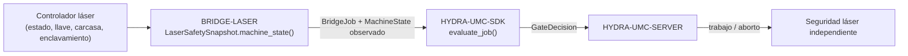

<!-- =============================================================================
HYDRA-UMC-BRIDGE-LASER - Puente de coordinación de celda láser
Copyright (C) 2026 JuanenRac (Electro Hobby 3D) <electrohobby3d@gmail.com>
GPL-3.0-or-later - see LICENSE
============================================================================= -->

<p align="center">
  
</p>

# 🔦 HYDRA-UMC-BRIDGE-LASER

<p align="center"><a href="README.md">🇺🇸 English</a> | 🇪🇸 <b>Español</b> | <a href="README_fra.md">🇫🇷 Français</a> | <a href="README_ita.md">🇮🇹 Italiano</a> | <a href="README_deu.md">🇩🇪 Deutsch</a> | <a href="README_zho.md">🇨🇳 简体中文</a> | <a href="README_jpn.md">🇯🇵 日本語</a></p>

### 🛑 Puente de coordinación seguro por defecto para celdas láser

<p align="left">
  
  
  
</p>

---

## 1. 🛠️ VISIÓN TÉCNICA GENERAL

**HYDRA-UMC-BRIDGE-LASER** es el puente de alto nivel para celdas láser y auxiliares robóticos HYDRA-UMC. Puede coordinar tareas periféricas seguras como el traspaso de material, pero **nunca** puede armar, disparar o anular un controlador láser: esas condiciones son observaciones que lee, no autoridades que posee.

Pertenece a la familia **External Automation Bridges**: un conjunto de repositorios hermanos (CNC, LASER, OPENPNP, PRINTER3D, ROS2) que hablan el mismo contrato de seguridad compartido de `HYDRA-UMC-SDK`, de modo que ningún puente puede inventar su propia definición de "seguro para trabajar".

### Características clave:
* ✅ **Instantánea de seguridad de cuatro señales, real:** `cell.py` — `LaserSafetySnapshot.machine_state()` exige que la llave esté habilitada, la carcasa cerrada **y** el enclavamiento en buen estado simultáneamente; si falta cualquiera de ellas, resuelve en `SAFE_STOP` incluso antes de leer `controller_state`. *(implementado, probado en `tests/test_cell.py`)*
* ✅ **Puerta de seguridad compartida, real:** cada trabajo observado se reevalúa mediante `evaluate_job()` de `bridge_contract` en `HYDRA-UMC-SDK`, la misma puerta que usan todos los puentes hermanos y HYDRA-UMC-SERVER. *(implementado)*
* ✅ **Mapeo de estado conservador:** solo `IDLE` se trata como reposo; `RUN`/`RUNNING`/`PAUSED` se mapean a `RUNNING`, `FAULT`/`ALARM`/`ERROR` a `FAULT`, y cualquier valor no reconocido cae en `OFFLINE`. *(implementado)*
* ✅ **Evidencia de seguridad de solo lectura:** `observation.py` solo acepta señales booleanas genuinas de llave, carcasa e enclavamiento; los valores faltantes, numéricos o de tipo texto fallan de forma segura. No puede armar ni disparar un láser. *(implementado, probado en `tests/test_observation.py`)*
* ✅ **Lectura real de enclavamiento GPIO, independiente del controlador:** `GpioSafetyProbe` de `gpio_safety.py` lee las mismas 3 protecciones independientes desde líneas GPIO reales (libgpiod v2) en vez de un mapeo guardado — deliberadamente agnóstico del controlador, ya que una llave/sensor de puerta/relé de enclavamiento es universal en cortadoras láser sin importar la marca. Un fallo de lectura GPIO hace fallar de forma segura las 3 protecciones. *(implementado, probado en `tests/test_gpio_safety.py`)*
* ✅ **Compilación/prueba no mutante:** `build-test.bat`/`.sh` compilan el código y ejecutan la batería de pruebas de la puerta de seguridad sin tocar archivos de versión ni el CHANGELOG. *(implementado, ver COMPILACIÓN Y EJECUCIÓN más abajo)*
* 🔜 **Integración concreta con controlador/software láser** — deliberadamente aplazada hasta que la máquina y su interfaz documentada estén disponibles. *(planeado)*

---

## 2. 🔄 FLUJO DE COORDINACIÓN DE CELDA



---

## 3. 🧱 ARQUITECTURA Y DECISIONES DE DISEÑO

* **Por qué cuatro observaciones de seguridad independientes en lugar de un solo booleano.** `LaserSafetySnapshot.machine_state()` comprueba `key_enabled`, `enclosure_closed` e `interlock_healthy` como tres condiciones separadas: la seguridad láser real necesita que cada resguardo físico sea independientemente verdadero; reducirlas a un solo indicador ocultaría cuál de ellas falló en realidad.
* **Por qué el puente documenta que nunca puede armar ni disparar un láser.** El propio docstring de `LaserCellBridge` afirma que "coordina solo auxiliares externos; no puede armar ni disparar un láser" — esas condiciones son observaciones de los propios enclavamientos certificados del controlador, nunca un sustituto de ellos.
* **Por qué el mapeo del estado del controlador es deliberadamente conservador.** Solo la cadena literal `IDLE` se mapea a `MachineState.IDLE`. Cualquier valor no reconocido cae en `OFFLINE`, nunca en algo que permitiría trabajo auxiliar.
* **Por qué el puente construye un nuevo `BridgeJob` y delega en el `evaluate_job()` compartido en lugar de escribir su propia lógica de aceptación/rechazo.** Los cinco External Automation Bridges (CNC, LASER, OPENPNP, PRINTER3D, ROS2) reutilizan exactamente el mismo `bridge_contract` de `HYDRA-UMC-SDK`, de modo que "qué cuenta como seguro para iniciar un trabajo" no puede divergir silenciosamente entre ellos.
* **Por qué la elección del software/controlador láser real se aplaza deliberadamente.** Comprometerse con la interfaz de un fabricante concreto antes de que la máquina y su reporte de enclavamiento documentado estén disponibles significaría afirmar una garantía de seguridad real que este núcleo local no puede verificar.
* **Cómo encaja en el resto del ecosistema.** BRIDGE-LASER se sitúa entre el controlador láser y `HYDRA-UMC-SDK` → `HYDRA-UMC-SERVER` → seguridad independiente: coordina trabajo robótico auxiliar alrededor de la celda láser, no reemplaza ni anula la seguridad láser certificada.

---

## 📂 ESTRUCTURA DE DIRECTORIOS

```text
HYDRA-UMC-BRIDGE-LASER/
├── src/
│   └── hydra_umc_bridge_laser/
│       ├── __init__.py
│       ├── cell.py              # Puerta de seguridad LaserSafetySnapshot + LaserCellBridge
│       ├── observation.py       # Normalización de solo lectura de la evidencia de seguridad
│       ├── gpio_safety.py       # Lee las 3 señales de seguridad reales e independientes por GPIO - nunca un comando láser
│       └── mqtt_transport.py    # Transporte MQTT real - solo estado/evidencia, este bridge no puede armar ni disparar un láser
├── tests/
│   ├── test_cell.py             # Admisión en reposo seguro, rechazo por carcasa, reenvío de aborto
│   ├── test_observation.py      # La evidencia de seguridad ausente falla cerrado
│   ├── test_gpio_safety.py      # Lecturas reales de seguridad GPIO contra un chip simulado, incl. rutas fail-closed
│   └── test_mqtt_transport.py   # Tests de forma de estado/evidencia MQTT contra un cliente de broker simulado
├── tools/
│   ├── build_test.py            # Compilador + ejecutor de pruebas no mutante (build-test.bat/.sh)
│   └── bump_version.py          # Sincroniza pyproject.toml, manifiesto y CHANGELOG.md
├── docs/
│   ├── BRIDGE_GUIDE.md                    # Alcance, plataformas compatibles, scripts, puerta de aceptación de hardware
│   └── CONTROLLER_EVIDENCE_BOUNDARY.md    # Qué cuenta como evidencia de seguridad real y qué se niega a inferir este bridge
├── images/
│   └── HYDRA_UMC_BANNER.svg     # Banner del README
├── build-test.bat / build-test.sh  # Solo valida, nunca modifica el repositorio
├── build.bat / build.sh            # Valida y, solo si tiene éxito, sube versión + CHANGELOG
├── pyproject.toml               # Metadatos del paquete; depende de HYDRA-UMC-SDK (git)
├── hydra-umc.project.json       # Manifiesto del ecosistema (versión, madurez, familia)
├── CHANGELOG.md
├── CODE_OF_CONDUCT.md / CONTRIBUTING.md / SECURITY.md / SUPPORT.md
├── LICENSE / LICENSE.md
└── README.md / README_*.md      # Este archivo y sus 6 traducciones
```

---

## 4. ⚙️ COMPILACIÓN Y EJECUCIÓN

Requiere Python 3.11+. `tools/build_test.py` espera que `HYDRA-UMC-SDK` esté clonado como directorio hermano (`../HYDRA-UMC-SDK`) o indicado mediante la variable de entorno `HYDRA_UMC_SDK_ROOT`.

```bash
# Windows
build-test.bat      # solo valida — sin cambio de versión/CHANGELOG
build.bat            # valida y, si tiene éxito, sube versión + CHANGELOG

# Linux/macOS
bash build-test.sh
bash build.sh
```

`build-test` compila cada módulo bajo `src/` con `py_compile` y ejecuta la batería completa de `unittest` (`tests/test_cell.py`), demostrando la admisión en reposo seguro, el rechazo por carcasa y el reenvío de aborto — nunca modifica el repositorio. `build` ejecuta primero esa misma validación y, solo si tiene éxito, llama a `tools/bump_version.py` para sincronizar la versión en `pyproject.toml`, `hydra-umc.project.json` y `CHANGELOG.md`. Todavía no existe un comando `run` real de láser — eso requiere una integración de controlador validada y segura.

---

## ✅ ESTADO ACTUAL Y PRÓXIMOS PASOS

**Real hoy:** versión `0.0.7`, un núcleo de planificación seguro por defecto probado en local (`LaserSafetySnapshot` + `LaserCellBridge`) apoyado en la puerta de trabajo compartida de `HYDRA-UMC-SDK`, normalización estricta de evidencia de seguridad en solo lectura que distingue un trabajo realmente en pausa (`HOLDING`) de uno realmente disparando (`RUNNING`), una lectura real de enclavamiento GPIO independiente del controlador (`GpioSafetyProbe`) para las 3 protecciones independientes de llave/carcasa/enclavamiento, una batería `unittest` determinista de veintisiete pruebas, y scripts de build-test no mutantes conectados a CI con clonado del SDK.

**Frontera de integración:** la carcasa, la llave y el enclavamiento certificados del propio controlador láser nunca se eluden; este puente solo controla trabajo robótico *auxiliar* a su alrededor, y únicamente leyendo su estado reportado.

**Todavía pendiente:** el puente no se ha conectado ni usado para operar un sistema láser real — elegir y validar una interfaz concreta de controlador/software se aplaza hasta disponer de la máquina y su interfaz documentada.

---

## 🔗 PROYECTOS RELACIONADOS

Este proyecto forma parte de un ecosistema robótico más amplio del mismo autor (JuanenRac / Electro Hobby 3D), que abarca firmware, software de control, nodos de IA y herramientas de flota. Merece la pena conocerlo, ya que una petición podría en realidad referirse a uno de estos proyectos y no a este repositorio.

### Directamente relacionados

- **[HYDRA-UMC-SDK](https://github.com/JuanenRac/HYDRA-UMC-SDK)** — la puerta de trabajo compartida `bridge_contract` a través de la cual este puente (y todos los demás) evalúa sus trabajos.
- **[HYDRA-UMC-SERVER](https://github.com/JuanenRac/HYDRA-UMC-SERVER)** — la frontera de celda autorizada a la que reporta este puente.
- **[HYDRA-UMC-MQTT-BROKER](https://github.com/JuanenRac/HYDRA-UMC-MQTT-BROKER)** — el transporte real de `mqtt_transport.py` para los propios topics `hydra/bridges/laser/...` de este puente (estado de las protecciones + la puerta de trabajo compartida - aquí no existe ningún comando de accionamiento real, este puente tampoco puede armar ni disparar un láser) - consulta el propio `docs/BRIDGE_TOPICS.md` de ese repositorio.
- **[HYDRA-UMC-SAFETY-ZONES](https://github.com/JuanenRac/HYDRA-UMC-SAFETY-ZONES)** — futura evidencia de seguridad de zona de celda.

### Resto del ecosistema

**Plataforma HYDRA-UMC** — la micro-fábrica multi-robot para la que este puente coordina auxiliares
- **[HYDRA-UMC](https://github.com/JuanenRac/HYDRA-UMC)** — la placa base CM5 + STM32H745 que orquesta hasta 8 brazos robóticos.
- **[HYDRA-UMC-SERVER](https://github.com/JuanenRac/HYDRA-UMC-SERVER)** — el backend Express/WebSocket con el que hablan todos los clientes de control y puentes.
- **[HYDRA-UMC-STUDIO](https://github.com/JuanenRac/HYDRA-UMC-STUDIO)** — panel de control web, visualización 3D multi-robot.

**External Automation Bridges** — repositorios hermanos que comparten esta misma puerta de trabajo de `HYDRA-UMC-SDK`
- **[HYDRA-UMC-BRIDGE-CNC](https://github.com/JuanenRac/HYDRA-UMC-BRIDGE-CNC)** — puente de coordinación de celda CNC.
- **[HYDRA-UMC-BRIDGE-OPENPNP](https://github.com/JuanenRac/HYDRA-UMC-BRIDGE-OPENPNP)** — puente de flujo de placas para OpenPnP.
- **[HYDRA-UMC-BRIDGE-PRINTER3D](https://github.com/JuanenRac/HYDRA-UMC-BRIDGE-PRINTER3D)** — puente de coordinación para software abierto de impresión 3D.
- **[HYDRA-UMC-BRIDGE-ROS2](https://github.com/JuanenRac/HYDRA-UMC-BRIDGE-ROS2)** — frontera de coordinación bidireccional con ROS 2.

**Evidencia de seguridad e integración**
- **[HYDRA-UMC-SAFETY-ZONES](https://github.com/JuanenRac/HYDRA-UMC-SAFETY-ZONES)** — evidencia de seguridad de zonas de celda usada en toda la familia de puentes.
- **[HYDRA-UMC-HIL-BRIDGE](https://github.com/JuanenRac/HYDRA-UMC-HIL-BRIDGE)** — evidencia de pruebas hardware-in-the-loop.

## 👤 AUTOR
**JuanenRac** (Electro Hobby 3D)
📧 electrohobby3d@gmail.com
📺 [youtube.com/@electrohobby3d](https://youtube.com/@electrohobby3d)

## 📜 LICENCIA
GPL-3.0 - Ver LICENSE para más detalles.
