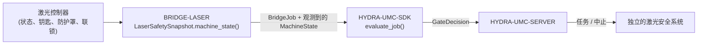

<!-- =============================================================================
HYDRA-UMC-BRIDGE-LASER - 激光单元协调桥接
Copyright (C) 2026 JuanenRac (Electro Hobby 3D) <electrohobby3d@gmail.com>
GPL-3.0-or-later - see LICENSE
============================================================================= -->

<p align="center">
  
</p>

# 🔦 HYDRA-UMC-BRIDGE-LASER

<p align="center"><a href="README.md">🇺🇸 English</a> | <a href="README_spa.md">🇪🇸 Español</a> | <a href="README_fra.md">🇫🇷 Français</a> | <a href="README_ita.md">🇮🇹 Italiano</a> | <a href="README_deu.md">🇩🇪 Deutsch</a> | 🇨🇳 <b>简体中文</b> | <a href="README_jpn.md">🇯🇵 日本語</a></p>

### 🛑 面向激光单元的故障安全协调桥接

<p align="left">
  
  
  
</p>

---

## 1. 🛠️ 技术概览

**HYDRA-UMC-BRIDGE-LASER** 是激光单元与 HYDRA-UMC 机器人辅助设备之间的高层桥接。它可以协调诸如物料交接之类的安全外围任务,但**绝不能**为激光控制器解锁、触发或越权操作——那些是它读取的观测量,而不是它拥有的权限。

它属于 **External Automation Bridges** 家族:一组共享 `HYDRA-UMC-SDK` 相同安全契约的兄弟仓库(CNC、LASER、OPENPNP、PRINTER3D、ROS2),因此任何一个桥接都不能自行发明"可以安全工作"的定义。

### 核心特性:
* ✅ **真实的四信号安全快照:** `cell.py` 中的 `LaserSafetySnapshot.machine_state()` 要求钥匙开关启用、防护罩关闭**且**联锁状态健康这三者同时成立;只要缺少任何一项,甚至在读取 `controller_state` 之前就会解析为 `SAFE_STOP`。*(已实现,并在 `tests/test_cell.py` 中测试)*
* ✅ **真实的共享安全门控:** 每个被观察到的任务都会通过 `HYDRA-UMC-SDK` 的 `bridge_contract` 中的 `evaluate_job()` 重新评估,这与所有兄弟桥接以及 HYDRA-UMC-SERVER 使用的是同一个门控。*(已实现)*
* ✅ **保守的状态映射:** 只有 `IDLE` 被视为空闲;`RUN`/`RUNNING`/`PAUSED` 映射为 `RUNNING`,`FAULT`/`ALARM`/`ERROR` 映射为 `FAULT`,任何无法识别的值都会回落到 `OFFLINE`。*(已实现)*
* ✅ **只读安全证据:** `observation.py` 只接受钥匙、防护罩和联锁的真实布尔信号;缺失、数值型或文本型的值都会安全失效关闭。它既不能使激光武装,也不能触发激光。*(已实现,在 `tests/test_observation.py` 中测试)*
* ✅ **真实的、与控制器无关的 GPIO 联锁读取:** `gpio_safety.py` 的 `GpioSafetyProbe` 直接从真实的 GPIO 线路(libgpiod v2)读取这 3 项独立防护,而不是依赖保存的映射——刻意做到与控制器无关,因为钥匙开关/门传感器/联锁继电器在各品牌激光切割机上都是通用的。GPIO 读取失败会使这 3 项防护全部安全失效关闭。*(已实现,在 `tests/test_gpio_safety.py` 中测试)*
* ✅ **非变更式构建/测试:** `build-test.bat`/`.sh` 编译源码并运行安全门控测试套件,不会触碰版本文件或 CHANGELOG。*(已实现,见下方"构建与运行")*
* 🔜 **具体的激光控制器/软件集成** —— 刻意推迟,直到设备及其文档化接口就绪。*(计划中)*

---

## 2. 🔄 单元协调流程



---

## 3. 🧱 架构与设计决策

* **为什么用四个独立的安全观测量,而不是一个布尔值。** `LaserSafetySnapshot.machine_state()` 将 `key_enabled`、`enclosure_closed` 和 `interlock_healthy` 作为三个独立条件分别检查——真实的激光安全要求每一项物理防护都独立成立;把它们压缩成一个标志会掩盖到底是哪一项失效了。
* **为什么桥接会明确声明它绝不能为激光解锁或触发。** `LaserCellBridge` 自身的文档字符串写明它"只协调外部辅助设备;不能为激光解锁或触发"——这些条件是对控制器自身已认证联锁装置的观测,绝不是它们的替代品。
* **为什么控制器状态的映射被刻意设计得保守。** 只有字面字符串 `IDLE` 会被映射为 `MachineState.IDLE`。任何无法识别的值都会回落到 `OFFLINE`,绝不会回落到允许辅助工作的状态。
* **为什么桥接会构造一个新的 `BridgeJob` 并委托给共享的 `evaluate_job()`,而不是自己编写接受/拒绝逻辑。** 全部五个 External Automation Bridges(CNC、LASER、OPENPNP、PRINTER3D、ROS2)都复用 `HYDRA-UMC-SDK` 中完全相同的 `bridge_contract`,因此"什么才算安全到可以启动任务"不会在它们之间悄悄产生分歧。
* **为什么真实激光软件/控制器的选型被刻意推迟。** 在设备及其文档化的联锁上报机制就绪之前就绑定某个特定厂商的接口,等于宣称一个这个本地核心无法验证的真实安全保证。
* **它如何融入整个生态系统。** BRIDGE-LASER 位于激光控制器与 `HYDRA-UMC-SDK` → `HYDRA-UMC-SERVER` → 独立安全系统之间:它协调围绕激光单元的辅助机器人工作,而不会取代或凌驾于已认证的激光安全系统之上。

---

## 📂 目录结构

```text
HYDRA-UMC-BRIDGE-LASER/
├── src/
│   └── hydra_umc_bridge_laser/
│       ├── __init__.py
│       └── cell.py              # LaserSafetySnapshot + LaserCellBridge 安全门控
├── tests/
│   └── test_cell.py             # 安全空闲准入、防护罩拒绝、中止转发
├── tools/
│   ├── build_test.py            # 非变更式编译 + 测试运行器 (build-test.bat/.sh)
│   └── bump_version.py          # 同步 pyproject.toml、清单和 CHANGELOG.md
├── build-test.bat / build-test.sh  # 仅验证,绝不修改仓库
├── build.bat / build.sh            # 先验证,成功后才更新版本 + CHANGELOG
├── pyproject.toml               # 包元数据;依赖 HYDRA-UMC-SDK (git)
├── hydra-umc.project.json       # 生态系统清单(版本、成熟度、家族)
├── CHANGELOG.md
├── CODE_OF_CONDUCT.md / CONTRIBUTING.md / SECURITY.md / SUPPORT.md
├── LICENSE / LICENSE.md
└── README.md / README_*.md      # 本文件及其 6 种译文
```

---

## 4. ⚙️ 构建与运行

需要 Python 3.11+。`tools/build_test.py` 期望 `HYDRA-UMC-SDK` 作为兄弟目录被检出(`../HYDRA-UMC-SDK`),或通过环境变量 `HYDRA_UMC_SDK_ROOT` 指定。

```bash
# Windows
build-test.bat      # 仅验证 —— 不改变版本/CHANGELOG
build.bat            # 先验证,成功后更新版本 + CHANGELOG

# Linux/macOS
bash build-test.sh
bash build.sh
```

`build-test` 使用 `py_compile` 编译 `src/` 下的每个模块,并运行完整的 `unittest` 套件(`tests/test_cell.py`),证明安全空闲准入、防护罩拒绝和中止转发均按预期工作 —— 它绝不会修改仓库。`build` 会先运行同样的验证,只有成功后才调用 `tools/bump_version.py`,在 `pyproject.toml`、`hydra-umc.project.json` 和 `CHANGELOG.md` 之间同步版本号。目前尚无真正的激光 `run` 命令 —— 这需要经过验证且安全的控制器集成。

---

## ✅ 当前状态与后续步骤

**目前真实的部分:** 版本 `0.0.4`,一个已在本地测试过的故障安全规划核心(`LaserSafetySnapshot` + `LaserCellBridge`),依托 `HYDRA-UMC-SDK` 的共享任务门控,包含严格的只读安全证据标准化,配有确定性的九项 `unittest` 测试套件,以及已接入 CI 并带 SDK 检出的非变更式 build-test 脚本。

**集成边界:** 激光控制器自身已认证的防护罩、钥匙开关和联锁权限从不被绕过;本桥接只负责围绕它门控*辅助*机器人工作,且仅通过读取其上报的状态。

**仍待完成:** 本桥接尚未连接或用于操作真实的激光系统 —— 选择并验证具体的控制器/软件接口被推迟到设备及其文档化接口就绪之后。

---

## 🔗 相关项目

本项目是同一作者(JuanenRac / Electro Hobby 3D)更大的机器人生态系统的一部分,涵盖固件、控制软件、AI 节点和车队工具。了解这一点很有必要,因为某个请求实际上可能与这些项目之一有关,而不是与本仓库有关。

### 直接相关

- **[HYDRA-UMC-SDK](https://github.com/JuanenRac/HYDRA-UMC-SDK)** —— 共享的 `bridge_contract` 任务门控,本桥接(以及所有其他桥接)都通过它评估任务。
- **[HYDRA-UMC-SERVER](https://github.com/JuanenRac/HYDRA-UMC-SERVER)** —— 本桥接汇报的经过授权的单元边界。
- **[HYDRA-UMC-MQTT-BROKER](https://github.com/JuanenRac/HYDRA-UMC-MQTT-BROKER)** —— 为本桥自身的 `hydra/bridges/laser/...` 主题(防护状态 + 共享作业门控——这里没有真正的驱动命令,本桥同样无法使激光武装或触发)提供的 `mqtt_transport.py` 真实传输 - 详见该仓库自身的 `docs/BRIDGE_TOPICS.md`。
- **[HYDRA-UMC-SAFETY-ZONES](https://github.com/JuanenRac/HYDRA-UMC-SAFETY-ZONES)** —— 未来的单元区域安全证据。

### 生态系统的其余部分

**HYDRA-UMC 平台** —— 本桥接为其协调辅助功能的多机器人微工厂
- **[HYDRA-UMC](https://github.com/JuanenRac/HYDRA-UMC)** —— 协调多达 8 条机械臂的 CM5 + STM32H745 主板。
- **[HYDRA-UMC-SERVER](https://github.com/JuanenRac/HYDRA-UMC-SERVER)** —— 每个控制客户端和桥接都会对接的 Express/WebSocket 后端。
- **[HYDRA-UMC-STUDIO](https://github.com/JuanenRac/HYDRA-UMC-STUDIO)** —— 基于网页的控制仪表盘,多机器人 3D 可视化。

**External Automation Bridges** —— 共享同一个 `HYDRA-UMC-SDK` 任务门控的兄弟仓库
- **[HYDRA-UMC-BRIDGE-CNC](https://github.com/JuanenRac/HYDRA-UMC-BRIDGE-CNC)** —— CNC 单元协调桥接。
- **[HYDRA-UMC-BRIDGE-OPENPNP](https://github.com/JuanenRac/HYDRA-UMC-BRIDGE-OPENPNP)** —— 面向 OpenPnP 的板级流程桥接。
- **[HYDRA-UMC-BRIDGE-PRINTER3D](https://github.com/JuanenRac/HYDRA-UMC-BRIDGE-PRINTER3D)** —— 面向开源 3D 打印软件的协调桥接。
- **[HYDRA-UMC-BRIDGE-ROS2](https://github.com/JuanenRac/HYDRA-UMC-BRIDGE-ROS2)** —— 与 ROS 2 之间的双向协调边界。

**安全与集成证据**
- **[HYDRA-UMC-SAFETY-ZONES](https://github.com/JuanenRac/HYDRA-UMC-SAFETY-ZONES)** —— 整个桥接家族共用的单元区域安全证据。
- **[HYDRA-UMC-HIL-BRIDGE](https://github.com/JuanenRac/HYDRA-UMC-HIL-BRIDGE)** —— 硬件在环测试证据。

## 👤 作者
**JuanenRac** (Electro Hobby 3D)
📧 electrohobby3d@gmail.com
📺 [youtube.com/@electrohobby3d](https://youtube.com/@electrohobby3d)

## 📜 许可证
GPL-3.0 - 详见 LICENSE。
